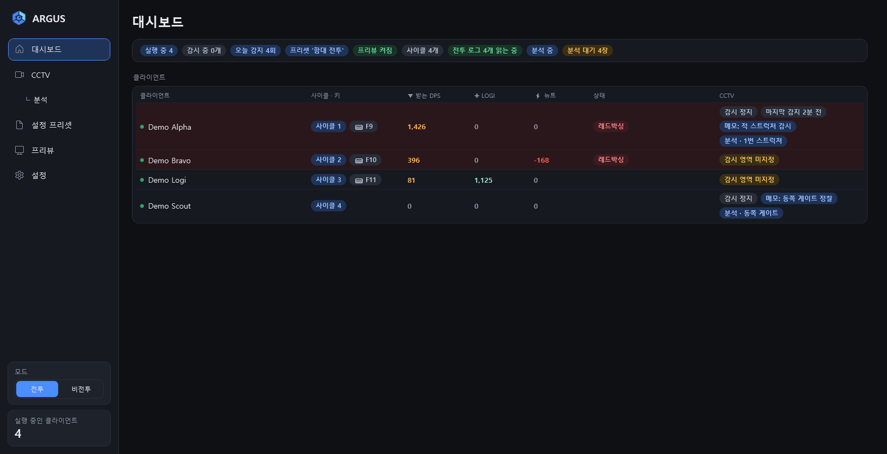
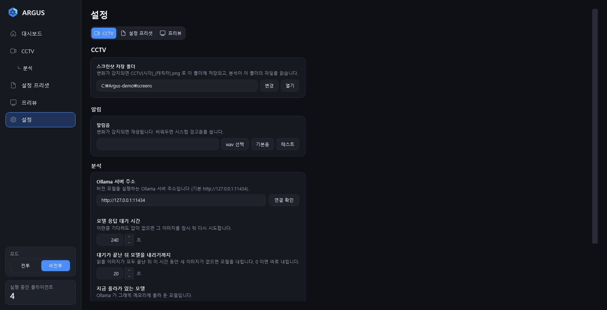
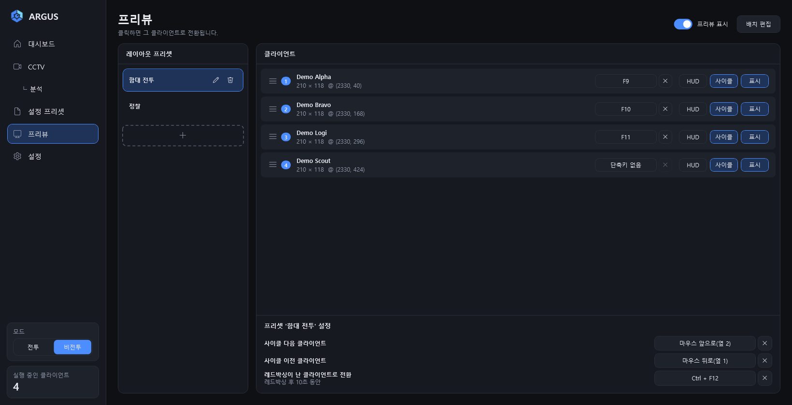
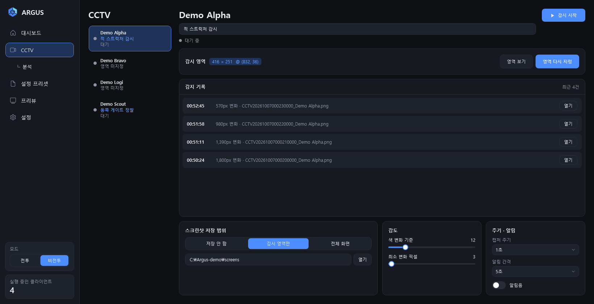
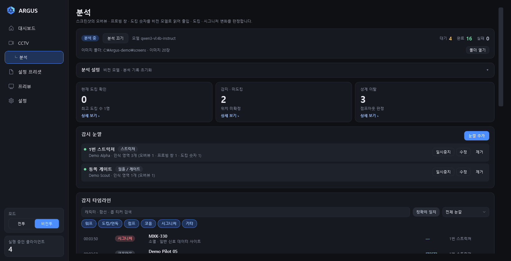
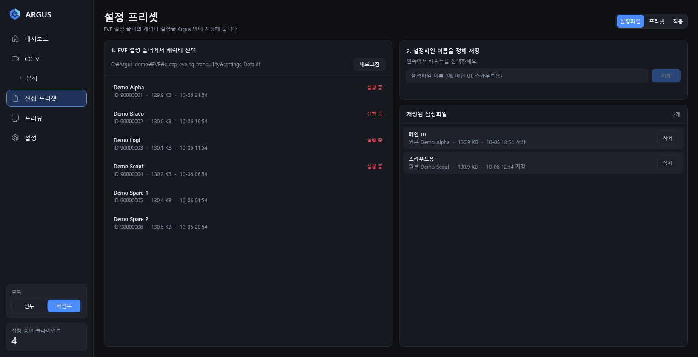

# Argus

> EVE Online 멀티 클라이언트를 한 창에서 다루는 Windows 보조 도구입니다. 클라이언트 프리뷰와 단축키 전환, 화면 변화 감시(CCTV), 스크린샷 분석, 캐릭터 설정 프리셋을 제공합니다.

**English summary**

- Argus is an unofficial Windows (WPF, .NET 10) companion for people who run several EVE Online clients at once. The UI is Korean only.
- It shows live client thumbnails that float above other windows (by default only while EVE or Argus is in front) with hotkey window switching, watches screen regions for changes, reads screenshots with a local Ollama vision model, and applies per-character settings presets. A combat HUD can show incoming DPS, remote repair and neut from the combat log.
- It never sends input to the game, reads game memory or intercepts packets. It is not affiliated with CCP Games.



> 화면의 이름·데이터는 모두 더미입니다. (이 문서의 모든 스크린샷에 해당합니다.)

## 목차

- [이런 도구입니다](#이런-도구입니다)
- [요구 사항](#요구-사항)
- [설치와 실행](#설치와-실행)
- [5분 시작 가이드](#5분-시작-가이드)
- [화면 구성](#화면-구성)
  - [사이드바](#사이드바)
  - [전투와 비전투 모드](#전투와-비전투-모드)
  - [클라이언트를 알아보는 방법](#클라이언트를-알아보는-방법)
  - [대시보드 읽는 법](#대시보드-읽는-법)
  - [설정 페이지](#설정-페이지)
- [기능별 사용법](#기능별-사용법)
  - [프리뷰](#프리뷰)
  - [CCTV](#cctv)
  - [분석](#분석)
  - [설정 프리셋](#설정-프리셋)
  - [전투 로그와 알림](#전투-로그와-알림)
- [단축키와 마우스 조작 한눈에](#단축키와-마우스-조작-한눈에)
- [데이터 저장 위치와 개인정보](#데이터-저장-위치와-개인정보)
- [문제 해결](#문제-해결)
- [알려진 한계](#알려진-한계)
- [약관과 면책](#약관과-면책)
- [개발자 정보](#개발자-정보)

## 이런 도구입니다

| 기능 | 하는 일 |
|---|---|
| **프리뷰** | 실행 중인 EVE 클라이언트마다 다른 창 위에 뜨는 실시간 축소 화면을 만듭니다 (기본값은 EVE 나 Argus 가 앞일 때만 보이며, 설정에서 항상 보이게 바꿀 수 있습니다). 프리뷰를 클릭하거나 단축키(마우스 옆 버튼 등)를 누르면 그 클라이언트가 앞으로 나옵니다. 배치·순서·단축키는 레이아웃 프리셋으로 저장합니다. |
| **CCTV** | 클라이언트 화면에서 지정한 영역이 바뀌면 알림음을 내고, 변화를 기록하고, 스크린샷(PNG)을 저장합니다. |
| **분석** | CCTV 스크린샷의 오버뷰·프로빙 창·도킹 숫자를 이 PC 의 Ollama 비전 모델로 읽어, 워프·점프·도킹·시그니처 변화 같은 이벤트를 판정합니다. |
| **설정 프리셋** | 캐릭터별 EVE 설정 파일을 Argus 안에 저장해 두고, 프리셋으로 묶어 다른 캐릭터에 한 번에 적용합니다. |
| **전투 HUD · 레드박싱** | EVE 전투 로그를 읽어 받는 DPS · LOGI · 뉴트를 프리뷰 위에 표시하고, 받는 피해가 갑자기 늘면 붉게 깜빡이며 그 클라이언트로 전환하는 단축키를 켭니다. |

Argus 는 게임에 입력을 보내지 않습니다. 단축키는 창을 앞으로 가져올 뿐이며, 여러 클라이언트에 입력을 동시에 보내는 기능은 없습니다.

## 요구 사항

| 항목 | 내용 |
|---|---|
| 운영체제 | Windows 11 (빌드 22000 이상) 기준으로 만들어졌습니다. Windows 10 에서의 동작은 확인하지 못했습니다. |
| 아키텍처 | x64 |
| 그래픽 | 하드웨어 Direct3D 11 지원 (CCTV 화면 캡처에 필요) |
| 빌드할 때 | .NET 10 SDK, 인터넷 연결 (NuGet 패키지 복원) |
| 실행할 때 | [.NET 10 Desktop Runtime (x64)](https://dotnet.microsoft.com/download/dotnet/10.0). 릴리즈의 `Argus.exe` 와 `publish.bat` 으로 만든 exe 모두 런타임을 포함하지 않는 단일 파일입니다. |
| 권한 | 보통은 일반 권한으로 실행합니다. EVE 를 관리자 권한으로 실행한다면 Argus 도 관리자 권한으로 실행해야 단축키가 동작합니다. |
| EVE Online | 캐릭터로 로그인한 클라이언트. 창 제목이 `EVE - 캐릭터이름` 으로 보여야 합니다. |
| 분석 기능만 | [Ollama](#분석) 와 이미지를 읽을 수 있는 비전 모델. 권장 모델은 `qwen2.5vl:7b` (그래픽 메모리 약 6GB) 입니다. 다른 기능은 Ollama 없이 동작합니다. |
| 전투 수치만 | EVE 가 기록하는 전투 로그. 한국어 클라이언트 로그로 검증했고 영어는 형식만 구현했습니다. |
| 인터넷 | 소스에서 빌드할 때 필요합니다. 실행 중에는 설정 프리셋 화면에서 캐릭터 이름을 조회할 때만 씁니다. |

## 설치와 실행

설치 프로그램은 없습니다. 결과물은 `Argus.exe` 하나입니다. 받아서 쓰는 방법과 직접 빌드하는 방법 두 가지가 있습니다.

### 릴리즈에서 받기

1. [.NET 10 Desktop Runtime (x64)](https://dotnet.microsoft.com/download/dotnet/10.0) 을 설치합니다. 이미 있으면 건너뜁니다.
2. [Releases](https://github.com/LanturnHouse/Argus/releases/latest) 에서 `Argus.exe` 를 받아 원하는 폴더에 둡니다.
3. `Argus.exe` 를 실행합니다.

- 코드 서명이 없는 파일이라 처음 실행할 때 Windows SmartScreen 이 "Windows의 PC 보호" 창을 띄울 수 있습니다. **추가 정보 → 실행** 을 누르면 됩니다. 릴리즈 설명에 파일의 SHA-256 이 적혀 있으니, 받은 파일이 같은지 `Get-FileHash .\Argus.exe` 로 확인할 수 있습니다.
- 설정과 기록은 exe 옆이 아니라 `%AppData%\Argus` 에 저장됩니다. exe 를 새 버전으로 바꿔도 설정은 그대로입니다. ([데이터 저장 위치](#데이터-저장-위치와-개인정보))

### 직접 빌드

1. **.NET 10 SDK** 를 설치합니다.
2. 소스를 받습니다. GitHub 의 Download ZIP 으로 받아 풀어도 됩니다.

   ```powershell
   git clone https://github.com/LanturnHouse/Argus.git
   cd Argus
   ```

3. 저장소 루트에서 `publish.bat` 을 실행합니다. 더블클릭해도 됩니다.

   ```powershell
   .\publish.bat
   ```

   - 실행 중인 `Argus.exe` 가 있으면 **강제 종료**한 뒤 빌드합니다.
   - 성공하면 `Done: ...\dist\Argus.exe` 가 출력되고, 실패하면 `Build failed.` 가 출력됩니다.
4. `dist\Argus.exe` 를 실행합니다.

결과물은 .NET 런타임을 포함하지 않는 단일 파일입니다. 다른 PC 로 옮겨 실행하려면 그 PC 에 .NET 10 Desktop Runtime(x64)이 있어야 합니다. 처음 실행할 때는 단일 파일 안의 네이티브 라이브러리(SQLite 등)가 임시 폴더(`%TEMP%\.net`)에 풀립니다.

빌드하지 않고 바로 실행해 보려면 다음 명령을 씁니다.

```powershell
dotnet run --project src/Argus.App
```

### 처음 실행하면

- 모듈이 모두 시작된 뒤에 메인 창이 뜹니다. 시작 대화상자, 로그인, 약관 화면은 없습니다.
- 창 제목은 `Argus`, 크기는 1200×820(최소 1160×640)이고 왼쪽에 사이드바가 있습니다. 어두운 테마만 있습니다.
- 처음 선택되는 화면은 **대시보드가 아니라 CCTV** 입니다.
- 모드는 **비전투** 입니다.
- 프리뷰는 기본으로 켜져 있어서, 실행 중인 EVE 클라이언트마다 프리뷰 창이 바로 뜹니다. 첫 레이아웃 프리셋 이름은 `기본` 입니다.
- 처음 한 번만, 마우스 옆 버튼 앞으로(옆 2)가 사이클 다음, 뒤로(옆 1)가 사이클 이전 단축키로 자동 지정됩니다.
- CCTV 감시와 분석은 실행할 때마다 꺼진 상태로 시작합니다.
- 트레이 아이콘이 없고 Windows 시작 시 자동 실행도 등록하지 않습니다. **메인 창을 닫으면 프리뷰 창도 함께 사라지며 앱이 종료됩니다.**
- Argus 를 두 번 실행하지 않도록 막는 장치가 없습니다. 하나만 실행하세요.

## 5분 시작 가이드

1. **EVE 클라이언트를 실행하고 캐릭터로 로그인합니다.** 로그인 화면과 캐릭터 선택 화면은 인식되지 않습니다.
2. **Argus 를 실행합니다.** 사이드바 아래 `실행 중인 클라이언트` 숫자가 늘고, `대시보드` 표에 줄이 생깁니다.
3. **프리뷰를 배치합니다.** 사이드바 `프리뷰` > **배치 편집** 을 누르고, 프리뷰를 끌어 놓고 가장자리를 끌어 크기를 바꾼 뒤 **편집 끝내기** 를 누릅니다. ([프리뷰](#프리뷰))
4. **전환 방법을 정합니다.** 프리뷰를 클릭하면 그 클라이언트로 전환됩니다. 마우스 옆 버튼(앞으로 = 다음, 뒤로 = 이전)도 바로 쓸 수 있습니다. 클라이언트 줄의 단축키 칸을 눌러 바로 이동 키를 지정할 수도 있습니다.
5. **CCTV 를 시험합니다.** 사이드바 `CCTV` 에서 캐릭터를 고르고 **영역 지정** 으로 화면의 한 부분을 드래그한 뒤 Enter 를 누르고 **▶  감시 시작** 을 누릅니다. 그 영역이 바뀌면 소리가 납니다. ([CCTV](#cctv))
6. **(선택) 전투 수치를 켭니다.** 사이드바 `모드` 를 **전투** 로 바꾸면 전투 로그를 읽어 프리뷰 화면 하단에 받는 DPS · LOGI · 뉴트가 표시됩니다. ([전투 로그와 알림](#전투-로그와-알림))
7. **(선택) 분석을 준비합니다.** Ollama 를 설치하고 비전 모델을 받은 뒤 (5번에서 감시를 한 번 시작해 스크린샷이 저장돼 있어야 합니다), CCTV 아래 `분석` 에서 감시 눈깔을 등록하고 **분석 켜기** 를 누릅니다. ([분석](#분석))
8. **(선택) 설정 프리셋을 만듭니다.** `설정 프리셋` 에서 캐릭터 설정을 저장하고 프리셋으로 묶어 적용합니다. ([설정 프리셋](#설정-프리셋))

## 화면 구성

### 사이드바

| 항목 | 화면 |
|---|---|
| `대시보드` | 요약 칩과 실행 중인 클라이언트 표 |
| `CCTV` | 화면 변화 감시 |
| `└ 분석` | CCTV 의 하위 항목. 스크린샷 분석 |
| `설정 프리셋` | 캐릭터 설정 파일 저장·프리셋·적용 |
| `프리뷰` | 프리뷰 배치, 레이아웃 프리셋, 단축키 |
| `설정` | 모든 기능의 설정 |

맨 아래에 두 개의 카드가 있습니다.

- **모드**: `전투` / `비전투` 전환 버튼입니다. ([전투와 비전투 모드](#전투와-비전투-모드))
- **실행 중인 클라이언트**: 인식된 EVE **창 개수**입니다. 같은 캐릭터의 창이 둘이면 2 입니다.

알림 · 전투 로그 · 기능 테스트는 사이드바에 항목이 없고 `설정` 페이지에만 나옵니다.

### 전투와 비전투 모드

사이드바 `모드` 카드의 `전투` / `비전투` 버튼으로 바꿉니다. 처음에는 `비전투` 이고, 마지막 선택을 기억해 다음 실행 때 복원합니다.

`비전투` 에서는 다음 세 가지가 멈춰 리소스를 아낍니다.

1. **전투 로그 읽기**
2. **프리뷰 HUD 수치** (받는 DPS · LOGI · 뉴트)
3. **레드박싱** (색조, 전환 키 안내, 레드박싱 전환 단축키)

- `전투` 로 바꾸면 그 시점부터 읽기 시작합니다. 이미 지나간 전투는 건너뜁니다.
- `비전투` 로 바꾸면 보이던 수치와 레드박싱이 즉시 지워집니다.
- 대시보드에서는 `비전투 모드` 칩이 뜨고 DPS · LOGI · 뉴트 열이 사라집니다.
- CCTV 감시, 분석, 프리뷰 썸네일, 단축키 전환에는 영향이 없습니다.

### 클라이언트를 알아보는 방법

Argus 는 1초마다 창을 훑어서 다음 조건을 모두 만족하는 창만 클라이언트로 봅니다.

- 창 제목이 `EVE - ` 로 시작하고 그 뒤에 캐릭터 이름이 있습니다 (대소문자 구분).
- 그 창의 프로세스 이름이 `exefile` 입니다. 같은 제목을 쓰는 EVE-O Preview 같은 썸네일 창은 제외됩니다.

이 규칙에서 따라오는 동작입니다.

- 로그인 전 화면과 캐릭터 선택 화면은 제목이 `EVE` 뿐이라 목록에 들어가지 않습니다.
- 로그아웃하면 제목이 `EVE` 로 돌아가 목록에서 빠집니다. 프리뷰만 창이 남아 있는 동안 마지막 위치에 남습니다.
- 같은 캐릭터 이름의 창이 여럿이면 **대시보드 · 프리뷰 · CCTV 는 첫 번째 창만** 씁니다.

### 대시보드 읽는 법

맨 위 스크린샷을 함께 보세요. 위쪽에 요약 칩 띠, 아래에 `클라이언트` 표가 있고 0.5초마다 갱신됩니다. 클라이언트가 없으면 `실행 중인 EVE 클라이언트가 없습니다.` 가 나옵니다. 일부 칩은 마우스를 올리면 설명이 뜹니다.

칩 색은 상태를 나타냅니다. 초록은 정상 동작, 노랑은 주의, 빨강은 오류·경보, 파랑은 강조, 회색은 일반·꺼짐입니다.

**요약 칩** (왼쪽부터)

| 칩 | 뜻 |
|---|---|
| `실행 중 N` (파랑) | 서로 다른 캐릭터 수. 사이드바 숫자는 창 개수라 다를 수 있습니다. |
| `감시 중 N개` (초록) / `감시 중 0개` (회색) | CCTV 로 감시 중인 캐릭터 수 |
| `오늘 감지 N회` (파랑) / `오늘 감지 0회` (회색) | 이번 실행 중 오늘 감지된 횟수. 지금 클라이언트 목록에 있는 캐릭터의 메모리 기록(캐릭터당 최대 200건)만 합산합니다. |
| `프리셋 '{이름}'` (파랑) | 지금 적용 중인 프리뷰 레이아웃 프리셋 |
| `프리뷰 켜짐` (초록) / `프리뷰 꺼짐` (회색) | 프리뷰 표시 여부 |
| `사이클 N개` (회색) | 다음/이전 전환에 포함된 클라이언트 수 (로그아웃 상태 제외) |
| `비전투 모드` (회색) / `전투 로그 N개 읽는 중` (초록) / `전투 로그 대기 중` (회색) | 전투 로그 상태 |
| `분석 중` (파랑) / `모델 올리는 중` (노랑) / `분석 켜짐` (초록) / `분석 꺼짐` (회색) / `분석 오류` (빨강) | 분석 상태. 오류는 마우스를 올리면 메시지가 보입니다. |
| `분석 대기 N장` (노랑) | 아직 읽지 않은 스크린샷 |
| `모듈 오류 N` (빨강) | 모듈 시작 또는 화면 생성에 실패한 건수. 마우스를 올리면 모듈별 오류가 보입니다. 실패한 모듈만 빠지고 나머지는 계속 동작합니다. |

**클라이언트 표**

아무 모듈도 채우지 않는 열은 표에서 빠집니다.

| 열 | 내용 |
|---|---|
| 클라이언트 | 초록 점과 캐릭터 이름. 이름에 마우스를 올리면 `PID n` 이 보입니다. 지금 앞에 있는 클라이언트 줄은 파란 배경에 `활성` 이 붙습니다. Argus 창이 앞이면 어느 줄도 `활성` 이 아닙니다. |
| 사이클 · 키 | `사이클 N` (순서) 또는 `사이클 제외`, 바로 이동 단축키가 있으면 `⌨ {단축키}` |
| ▼ 받는 DPS / ✚ LOGI / ⚡ 뉴트 | 전투 로그를 읽고 있는 캐릭터에만 나옵니다. 정수에 천 단위 쉼표로 표시하고 0 이면 흐립니다. 뉴트는 캡이 빠지면 빨강 `-N`, 늘어나면 파랑 `+N` 입니다. |
| 상태 | `프리뷰 숨김` (노랑), `레드박싱` (빨강. 유지 시간 안에서만 뜨고, 레드박싱 전환 단축키로 그 클라이언트로 옮기면 사라집니다. HUD 의 `레드박싱 경고` 를 꺼 둔 클라이언트에도 칩은 뜹니다. 이때 줄 배경이 붉어집니다) |
| CCTV | `감시 영역 미지정` / `감시 중` / `감시 정지`, `마지막 감지 N초 전` (분·시간 전, 하루가 넘으면 `M월 d일`), `메모: {내용}`, `분석 · {눈깔 이름}` |

대시보드 줄을 클릭해도 아무 일도 일어나지 않습니다.

### 설정 페이지



사이드바 `설정` 을 열면 위쪽에 탭이 있습니다.

| 탭 | 안에 들어 있는 것 |
|---|---|
| `CCTV` | `스크린샷 저장 폴더` 카드 → 소제목 **알림** (알림음) → 소제목 **분석** (Ollama 서버 등) |
| `설정 프리셋` | `EVE 설정 폴더` |
| `프리뷰` | 프리뷰 설정 카드 → 소제목 **전투 로그** → 소제목 **기능 테스트** |

- 마지막으로 본 탭은 이번 실행 동안만 기억합니다.
- 별도 저장 버튼은 없습니다. 값을 바꾸면 바로 저장·적용되고, 텍스트 상자(Ollama 서버 주소 등)는 입력칸을 벗어날 때 저장됩니다.
- 설정 페이지에서 슬라이더는 % 로 조절하는 값에만 쓰고, 나머지 수치는 숫자 입력칸입니다 (CCTV 페이지의 `감도` 카드는 슬라이더입니다). 오른쪽 위·아래 화살표, 방향키, (입력칸에 포커스가 있을 때) 마우스 휠로 한 단계씩 바꿉니다. Shift 를 누르면 10배입니다. Enter 로 확정하고 Esc 로 취소하며, 범위를 벗어난 값은 가까운 끝값으로 보정되고 숫자가 아니면 이전 값으로 돌아갑니다.

## 기능별 사용법

### 프리뷰



#### 무엇을 하나

실행 중인 EVE 클라이언트마다 실시간 축소 화면(Windows DWM 썸네일)을 다른 창 위에 띄웁니다. 기본값에서는 EVE 클라이언트·프리뷰·Argus 창이 앞일 때만 보입니다 (아래 `설정 항목` 의 표시 조건 참고).

- 원본의 제목 표시줄을 뺀 클라이언트 영역만 보입니다.
- 프리뷰를 클릭해도 포커스를 가져가지 않고 Alt+Tab 목록에도 나타나지 않습니다.
- 프리뷰 위에는 이름표, 경계선, 전투 수치 바, 레드박싱 색조를 투명한 창으로 겹쳐 그립니다. 이 창은 클릭이 아래로 통과합니다.
- 프리뷰 높이는 EVE 창의 비율에 맞춰 자동으로 보정됩니다. EVE 창 크기를 바꾸면 프리뷰 높이가 따라갑니다.

#### 준비

- EVE 클라이언트에 캐릭터로 로그인합니다. 로그인한 클라이언트는 현재 프리셋 목록 맨 끝에 자동으로 붙고, 새 프리뷰는 주 모니터 왼쪽 위에서 20px 떨어진 곳부터 다른 프리뷰와 겹치지 않는 첫 빈자리에 놓입니다.
- 클라이언트가 꺼지면 목록에서 사라지지만 위치·단축키는 프리셋에 남아 있어, 다시 로그인하면 복원됩니다.
- 프리뷰를 직접 추가하거나 삭제하는 기능은 없습니다.

#### 단계별 사용법

1. **배치** — 프리뷰 페이지 오른쪽 위의 **배치 편집** 을 누르면 버튼이 **편집 끝내기** 로 바뀌고 프리뷰마다 파란 점선 테두리가 생깁니다. 프리뷰를 끌어 옮기고 가장자리를 끌어 크기를 바꿉니다. 평소(편집 모드가 아닐 때)에도 오른쪽 버튼을 누른 채 끌면 이동할 수 있습니다.
2. **순서** — `클라이언트` 카드에서 줄 왼쪽의 `≡` 손잡이를 위아래로 끌어 순서를 바꿉니다. 이 순서가 사이클 순서입니다.
3. **사이클·표시** — 줄 오른쪽의 **사이클** 버튼은 다음/이전 전환에 포함할지, **표시** 버튼은 이 프리셋에서 그 프리뷰를 보일지를 정합니다. 둘 다 기본 켜짐이고, 꺼진 버튼은 흐려집니다.
4. **단축키** — 아래 [단축키](#단축키) 를 참고합니다.
5. **프리셋** — 배치·순서·단축키 묶음을 이름을 붙여 저장해 두고 전환합니다. 아래 [레이아웃 프리셋](#레이아웃-프리셋) 을 참고합니다.
6. **전환** — 프리뷰를 왼쪽 클릭하거나 단축키를 누르면 그 클라이언트가 앞으로 나옵니다. 최소화돼 있으면 복원됩니다.

#### 프리뷰 창 조작

평소 (편집 모드가 꺼져 있을 때)

| 조작 | 동작 |
|---|---|
| 왼쪽 클릭 | 그 클라이언트로 전환 |
| 오른쪽 버튼을 누른 채 끌기 | 프리뷰 이동 (합계 5px 이상 움직여야 끌기로 인정). 크기는 바뀌지 않습니다. |
| 오른쪽 클릭 (끌지 않고) | 메뉴: **기본 크기로** (설정의 기본 프리뷰 크기로 되돌림, 왼쪽 위 위치 유지) / **이 프리뷰 숨기기** (이 프리셋에서 `표시` 를 끔) |

이동 중에는 다른 보이는 프리뷰의 가장자리와 모니터 가장자리에 10px 이내로 다가가면 달라붙습니다.

배치 편집 모드

| 조작 | 동작 |
|---|---|
| 프리뷰 안쪽을 왼쪽 버튼으로 끌기 | 이동 (같은 자석 효과) |
| 가장자리 안쪽 8px 띠나 모서리를 왼쪽 버튼으로 끌기 | 크기 조절. 항상 화면 비율을 유지하고 폭은 120~1600px 입니다. 커서 모양이 영역에 따라 바뀝니다. |
| `Ctrl` + 크기 조절 | 같은 프리셋에서 표시 중인 나머지 프리뷰도 같은 비율로 함께 커지고 작아집니다. 도중에 Ctrl 을 떼면 나머지는 원래 크기로 돌아갑니다. |
| `Shift` + 클릭 | 그 프리뷰를 기본 크기로 되돌림 |

편집 모드에서는 왼쪽 클릭으로 전환되지 않고 오른쪽 클릭 메뉴도 뜨지 않습니다. 이때는 `EVE 를 플레이 중일 때만 프리뷰 표시` 와 `지금 활성인 클라이언트의 프리뷰 숨기기` 조건이 무시되어, 켜진 프리뷰가 모두 보입니다.

#### 프리뷰에 항상 보이는 것

- 왼쪽 위에 캐릭터 이름표 (주황 글씨)
- 검은 1px 경계선 (붙여 놓아도 구분되도록)
- 활성 클라이언트(마지막으로 앞에 있었던 EVE 클라이언트)의 프리뷰는 **흰색 테두리 안쪽에 검은 선이 있는 이중 테두리**로 표시됩니다. 브라우저나 Argus 가 앞으로 와도 마지막 클라이언트의 표시는 유지됩니다. Argus 를 막 켠 직후에는 EVE 창을 한 번 앞으로 가져오기 전까지 활성 프리뷰가 없습니다. (대시보드의 `활성` 은 지금 실제로 맨 앞인 창 기준입니다.)
- 원본 창이 최소화돼 있으면 `최소화됨` 글자 (프리뷰를 클릭하면 창이 복원되며 전환됩니다)
- 프리뷰 하단의 전투 수치 바와 레드박싱 표시 ([전투 로그와 알림](#전투-로그와-알림))

#### 프리뷰 페이지의 요소

**위쪽**: 체크박스 **프리뷰 표시** 는 프리뷰 전체를 켜고 끕니다 (프리셋과 무관한 전역 값). 끄면 배치 편집 중에도 프리뷰가 보이지 않습니다.

**클라이언트 카드의 한 줄**

| 요소 | 설명 |
|---|---|
| `≡` | 끌어서 순서 바꾸기 |
| 사이클 순서 배지 | 사이클이 켜진 클라이언트에 1, 2, 3… 을 매깁니다. 꺼져 있거나 로그아웃 상태면 `-` 입니다. |
| 이름 + 흐린 한 줄 | `{가로} × {세로}  @ ({X}, {Y})` (프리뷰 크기와 화면 좌표, 물리 픽셀) |
| ⚠ | 이 클라이언트의 단축키가 겹칠 때만 나타납니다. 마우스를 올리면 경고가 보입니다. |
| 단축키 칸 | 이 클라이언트로 바로 이동하는 단축키. 비어 있으면 `단축키 없음`. 누르면 지정 모드가 됩니다. |
| X 버튼 | 단축키 지우기 |
| **HUD** 버튼 | 이 프리뷰 위에 표시할 항목을 고르는 체크 메뉴: `받는 DPS  ▼`, `받는 LOGI  ✚`, `받는 뉴트 (노스·캡 전송 반영)  ⚡`, `레드박싱 경고 (붉은 깜빡임 · 전환 키 안내)`. 모두 기본 켜짐이며 클라이언트별·프리셋별로 저장됩니다. |
| **사이클** 버튼 | 다음/이전 전환에 포함 (기본 켜짐) |
| **표시** 버튼 | 이 프리셋에서 프리뷰를 보일지 (기본 켜짐). 숨긴 프리뷰는 여기서 다시 켭니다. |

**프리뷰가 보이려면** ① 프리뷰 페이지 오른쪽 위의 `프리뷰 표시` 체크, ② 그 클라이언트 줄의 `표시` 버튼, ③ `설정 > 프리뷰` 의 숨김 조건(`EVE 를 플레이 중일 때만 프리뷰 표시`, `지금 활성인 클라이언트의 프리뷰 숨기기`)을 모두 통과해야 합니다. 배치 편집 중에는 ③ 이 무시됩니다.

**로그아웃과 최소화**: 로그아웃해도 창이 남아 있는 동안 프리뷰는 마지막 위치에 그대로 남고, 사이클 배지는 `-` 가 되며 바로 이동 단축키는 동작하지 않습니다. 같은 창에 다른 캐릭터가 로그인하면 이전 프리뷰를 치우고 새 캐릭터의 저장된 위치에 프리뷰를 띄웁니다. 창이 닫히면 프리뷰도 사라집니다.

모니터 구성이 바뀌어 저장된 위치가 어느 모니터에도 걸치지 않으면 주 모니터의 빈 자리로 옮겨집니다.

#### 단축키

프리뷰 페이지에서 지정합니다. 클라이언트 줄에 있는 칸은 **그 클라이언트로 바로 이동**하고, 클라이언트 카드 아래 `프리셋 '{이름}' 설정` 의 세 줄은 다음과 같습니다.

| 줄 | 동작 |
|---|---|
| `사이클 다음 클라이언트` | 사이클 순서에서 다음 클라이언트로 전환 |
| `사이클 이전 클라이언트` | 사이클 순서에서 이전 클라이언트로 전환 |
| `레드박싱이 난 클라이언트로 전환` | 레드박싱이 난 클라이언트로 전환 ([레드박싱](#레드박싱) 참고) |

**지정 방법**

1. 지정할 칸을 누릅니다. 글자가 `누르세요…  (Esc 취소)` 로 바뀝니다.
2. 원하는 키나 마우스 버튼을 누릅니다. 이 입력은 EVE 로 전달되지 않고 지정에만 쓰입니다.

| 지정할 수 있는 입력 | 설명 |
|---|---|
| 마우스 | 가운데 버튼(칸에는 `마우스 가운데`), 옆 버튼 뒤로(`마우스 뒤로(옆 1)`), 옆 버튼 앞으로(`마우스 앞으로(옆 2)`). 보조키 없이도 가능합니다. 왼쪽·오른쪽 버튼과 휠은 지정할 수 없습니다. |
| 키보드 | 보조키 없이는 **F1~F24, 숫자패드 키, Pause, ScrollLock** 만 가능합니다. 그 밖의 키(글자, 숫자, 방향키, Space, Enter, Tab 등)는 Ctrl/Alt/Shift/Win 중 하나 이상과 함께 눌러야 합니다. |
| 보조키 | Ctrl, Alt, Shift, Win. 여러 개를 조합할 수 있습니다. |

- 칸에는 `Ctrl + F5`, `Shift + 마우스 가운데` 같은 형태로 표시됩니다.
- **지정은 Argus 창이 앞일 때만** 받습니다. 칸을 누른 뒤 10초가 지나면 자동 취소되고, 한 번에 하나의 칸만 지정할 수 있습니다.
- `Esc` (보조키 없이)는 지정을 취소할 뿐 단축키를 지우지 않습니다. 지우려면 칸 옆 **X** 버튼을 누릅니다.
- 보조키 없이 허용되지 않는 키를 누르면 지정은 계속 기다리고, 프리셋 설정 칸 위에 `글자·숫자 같은 일반 키는 채팅을 막으므로 Ctrl/Alt/Shift 와 함께 누르세요. (F1~F24, 숫자패드는 그대로 가능)` 안내가 뜹니다.
- 처음 한 번만 `기본` 프리셋에 마우스 옆 버튼 앞으로(옆 2) = 사이클 다음, 뒤로(옆 1) = 사이클 이전이 들어갑니다. 지워도 다시 채워지지 않습니다.

**동작 방식**

- **사이클 다음/이전**: 사이클이 켜져 있고 실행 중(로그아웃 아님)인 클라이언트가 대상입니다. 순서는 프리셋의 클라이언트 목록 순서이며 끝에서 처음으로 순환합니다. 지금 앞의 창이 대상 밖(사이클을 끈 클라이언트, 다른 EVE 창, Argus 등)이면 `다음` 은 첫 번째, `이전` 은 마지막으로 갑니다. 대상이 하나이고 이미 그 창이 앞이면 아무 일도 하지 않습니다.
- **바로 이동**: 사이클 포함 여부와 무관하게 그 캐릭터 창을 앞으로 가져옵니다. 로그아웃해서 창만 남은 클라이언트의 바로 이동 키는 전환 없이 입력만 삼켜집니다. 클라이언트 창이 닫혀 프리뷰가 사라지면 그 키는 등록에서 빠져 입력이 그대로 전달됩니다.
- 일치한 입력은 EVE 로 전달되지 않고 삼켜집니다. 키를 누르고 있어도 한 번만 동작합니다.
- 같은 키에 여러 단축키가 걸리면, 보조키 옵션이 켜져 있을 때 보조키를 더 많이 요구하는 쪽이 우선합니다. 완전히 같은 키라면 사이클 다음 → 사이클 이전 → 클라이언트 바로 이동(목록 순) → 레드박싱 전환 순서로 우선합니다.

**겹침 경고**: 활성 프리셋의 실행 중인 클라이언트 키와 프리셋 키(레드박싱 전환 키는 평소 동작하지 않을 때도 포함)를 서로 비교해, 지정은 막지 않고 경고만 보여 줍니다 (프리셋 설정 칸 위의 노란 박스와 클라이언트 줄의 ⚠).

| 경고 | 의미 |
|---|---|
| 같은 단축키 | 두 동작이 같은 키를 씁니다. 먼저 등록된 쪽이 우선합니다. |
| 보조키 포함 관계 | 한 단축키가 다른 단축키에 보조키를 더한 조합입니다. 보조키 옵션이 켜져 있으면 Ctrl 등과 함께 눌렀을 때 보조키가 더 많은 쪽이 먼저 동작합니다. |
| 보조키 없는 F1~F8 | EVE 의 기본 모듈 단축키와 겹칩니다. EVE 가 앞에 있을 때 이 키는 전환에 쓰이고 EVE 로 전달되지 않습니다. |

#### 레이아웃 프리셋

프리셋은 배치·사이클·단축키 묶음입니다. 처음에는 `기본` 하나가 있습니다.

| 조작 | 동작 |
|---|---|
| 목록의 프리셋 이름 클릭 | 그 프리셋으로 전환. 모든 프리뷰의 위치·표시와 단축키가 그 프리셋의 값으로 바뀝니다. |
| 연필 아이콘 (**이름 변경**) | 줄을 선택하거나 마우스를 올리면 나타납니다. 창 제목 `프리셋 이름 변경`, 최대 40자, Enter 확인 / Esc 취소 |
| 휴지통 아이콘 (**삭제**) | 확인 후 삭제. 프리셋은 최소 하나가 있어야 합니다. |
| 맨 아래 점선 칸의 `+` (**새 프리셋**) | 현재 프리셋의 배치·순서·클라이언트 단축키·HUD 켜짐·프리셋 단축키를 복사해서 시작하고 바로 그 프리셋으로 전환 |

이름은 대소문자 구분 없이 중복될 수 없습니다. 프리셋에 없는 클라이언트가 실행 중이면 전환할 때 그 프리셋에 새 줄이 자동으로 생깁니다.

**프리셋에 저장되는 것**: 클라이언트별 위치·크기·`표시`·`사이클`·목록 순서·바로 이동 단축키·HUD 켜짐, 그리고 사이클 다음/이전/레드박싱 전환 단축키.
**프리셋과 무관한 것(전역)**: `프리뷰 표시` 체크, `설정 > 프리뷰` 의 모든 항목.

#### 설정 항목

`설정 > 프리뷰` 탭의 첫 카드입니다. 레드박싱 세 항목은 [레드박싱](#레드박싱) 에서 설명합니다.

| 항목 | 기본값 | 설명 |
|---|---|---|
| **표시 조건**: `EVE 를 플레이 중일 때만 프리뷰 표시` | 켜짐 | 켜면 맨 앞 창이 EVE 클라이언트(로그인·캐릭터 선택 창 포함), 프리뷰 창, Argus 창일 때만 프리뷰가 보입니다. 브라우저 같은 다른 프로그램이 앞이면 숨습니다. 숨기는 데에는 약 0.2초 지연이 있습니다. 끄면 항상 보입니다. |
| **기본 프리뷰 크기** | `기본 (210)` | `작게 (160)` / `기본 (210)` / `보통 (280)` / `크게 (360)` / `아주 크게 (480)` 중 선택. 새 프리뷰의 가로 크기이며 세로는 화면 비율로 정해집니다. 새 프리뷰와 `기본 크기로` 재설정에만 적용되고 이미 놓인 프리뷰는 바뀌지 않습니다. |
| **불투명도** | 100% | 30~100% (5% 단위). 프리뷰 화면(썸네일) 자체의 불투명도입니다. 이름표·수치 바 같은 HUD 는 영향을 받지 않습니다. |
| **HUD 수치 바 투명도** | 100% | 20~100% (5% 단위). 받는 DPS · LOGI · 뉴트 표시의 투명도 |
| **활성 클라이언트**: `지금 활성인 클라이언트의 프리뷰 숨기기` | 꺼짐 | 활성 클라이언트(마지막으로 앞에 있었던 EVE 클라이언트)의 프리뷰만 숨기고 나머지를 보여 줍니다. 브라우저 등이 앞으로 와도 그 클라이언트의 프리뷰는 숨은 채 남습니다. |
| **단축키 동작 범위**: `단축키 사용` | 켜짐 | 끄면 입력을 단축키와 비교하지도, 삼키지도 않습니다. (지정 모드는 계속 가능합니다. 키보드·마우스 훅 자체는 Argus 가 실행되는 동안 계속 설치되어 있습니다.) |
| 〃 `EVE 클라이언트나 Argus 가 맨 앞일 때만 단축키 동작` | 켜짐 | 켜면 다른 프로그램에서는 입력이 그대로 전달됩니다. 로그인·캐릭터 선택 창도 EVE 로 칩니다. |
| 〃 `보조키(Ctrl·Shift·Alt)를 누른 채로도 동작` | 켜짐 | 지정한 보조키가 눌려 있으면 더 많은 보조키가 눌려 있어도 동작합니다. 끄면 정확히 일치해야 합니다. 라벨에 없지만 Win 키도 보조키로 취급됩니다. |

#### 팁·주의

- 프리뷰가 EVE 위에 떠서 가려지면 **배치 편집** 으로 위치를 옮기거나, 클라이언트 줄의 **표시** 를 꺼서 숨깁니다.
- 자동 정렬 버튼은 없습니다. 자석 효과로 직접 붙여 배치합니다.
- 프리셋마다 다른 배치를 만들어 두고 상황에 따라 전환하면 편리합니다.
- 클라이언트 줄의 `⚠` 가 보이면 단축키가 겹친 것입니다. 마우스를 올려 내용을 확인하세요.

### CCTV



#### 무엇을 하나

EVE 클라이언트 창 **하나당 감시 하나**를 돌립니다. 사용자가 지정한 사각형(감시 영역)의 픽셀이 직전 캡처와 달라지면 다음을 합니다.

1. 알림음을 냅니다 (캐릭터의 `알림음` 이 켜져 있을 때).
2. 감지 기록에 한 줄을 남깁니다.
3. 스크린샷(PNG)을 저장합니다 (저장 범위가 `저장 안 함` 이 아닐 때).
4. 스크린샷을 저장했다면 분석 기능에 알려 저장 폴더를 바로 다시 확인하게 합니다.

CCTV 자체는 화면의 내용을 해석하지 않고 픽셀이 변했는지만 판단합니다. 내용을 읽는 일은 [분석](#분석) 이 합니다.

화면은 Windows Graphics Capture 로 읽습니다. 다른 창에 가려져 있어도 캡처되며 마우스 커서는 포함되지 않고, 제목 표시줄을 뺀 클라이언트 영역만 읽습니다.

#### 준비

- 캐릭터로 로그인한 클라이언트가 있어야 목록에 나타납니다.
- 클라이언트 창이 최소화돼 있으면 캡처할 수 없습니다. 감시는 돌아가지만 그동안 캡처·비교·저장을 하지 않으며, 창을 복원하면 다시 캡처합니다. 최소화된 동안에는 비교 기준이 바뀌지 않으므로, 창을 복원한 직후 첫 캡처가 최소화 직전 화면과 다르면 변화로 알립니다.
- 클라이언트가 하나도 없으면 `감시할 클라이언트가 없습니다.` 가 나옵니다.

#### 단계별 사용법

1. 사이드바 `CCTV` 를 열고 왼쪽 목록에서 캐릭터를 고릅니다. 앱을 열면 첫 번째 클라이언트가 자동 선택됩니다.
2. **영역 지정** (이미 영역이 있으면 **영역 다시 지정**)을 누릅니다. 클라이언트 화면을 새로 캡처해 전체 화면 선택 창이 뜹니다. 마우스 왼쪽 버튼으로 드래그해 영역을 그리고 **확인 (Enter)** 을 누릅니다.
3. (선택) 헤더의 메모 칸에 감시 대상을 적습니다. 예: `적 스트럭처 200km 지정 감시`
4. 필요하면 감도·주기·저장 범위를 조정합니다.
5. **▶  감시 시작** 을 누릅니다. 시작하면 버튼이 **■  감시 중지** 로 바뀝니다. 영역이 없으면 시작 버튼이 비활성이고, 헤더 상태 줄에 `감시 영역을 지정하면 시작할 수 있습니다` 가 보입니다 (버튼에 마우스를 올리면 `먼저 감시 영역을 지정하세요` 툴팁이 뜹니다).
6. 변화가 감지되면 `감지 기록` 카드에 한 줄씩 쌓이고 알림음이 납니다. 줄의 **열기** 로 저장된 PNG 를 엽니다.

**영역 지정 창**

| 조작 | 동작 |
|---|---|
| 왼쪽 버튼으로 드래그 | 영역 그리기. 어느 방향이든 되고 이미지 밖은 잘립니다. 놓은 뒤 다시 드래그하면 새로 그립니다. |
| `Enter` / **확인 (Enter)** | 확정 (선택이 4×4 픽셀 이상일 때만) |
| `Esc` / **취소 (Esc)** | 취소 (기존 영역 유지) |

- 가로·세로가 4픽셀 미만이면(클릭만 한 경우 포함) 선택이 없어집니다.
- 이미 영역이 있으면 그 영역이 미리 선택된 채 열립니다.
- 확정하면 즉시 저장되고, 감시 중이어도 중지하지 않고 새 영역이 바로 적용됩니다.
- 좌표는 클라이언트 영역 왼쪽 위를 (0,0) 으로 한 원본 픽셀입니다.

**영역 보기**: 지정한 영역만 잘라 0.5초마다 실시간으로 보여 주는 별도 창입니다. 감시를 시작하지 않아도 열립니다. 창이 최소화돼 있으면 `창이 최소화되어 캡처할 수 없습니다` 가 표시됩니다.

#### 페이지의 요소

| 위치 | 내용 |
|---|---|
| 왼쪽 목록 | 실행 중인 캐릭터가 나옵니다. 앱을 켠 시점에 이미 있던 캐릭터는 이름순이고, 그 뒤에 새로 로그인한(또는 로그아웃했다 다시 로그인한) 캐릭터는 목록 맨 아래에 붙습니다. 감시 중이면 초록 점, 아니면 회색 점이며 메모와 상태 문구가 함께 보입니다. |
| 헤더 | 캐릭터 이름, 메모 칸(최대 120자. Enter 를 누르거나 칸을 벗어나면 저장), 상태 줄, **▶  감시 시작** / **■  감시 중지** |
| `감시 영역` 카드 | 배지에 `{너비} × {높이}  @ ({X}, {Y})` 또는 `미지정`. 버튼 **영역 보기**, **영역 지정** |
| `감지 기록` 카드 | 최근 감지 목록. 카드 머리에 `최근 N건` 이 보입니다. 한 줄은 시각 `HH:mm:ss` + `{n}px 변화 · {파일명}` (저장 안 했으면 `저장 안 함`) + **열기**. 비어 있으면 `아직 감지된 변화가 없습니다.` |
| `스크린샷 저장 범위` 카드 | 3분할 선택 버튼(`저장 안 함` / `감시 영역만` / `전체 화면`)과 현재 저장 폴더 경로(읽기 전용), **열기** 버튼. 폴더 변경은 `설정 > CCTV` 에서 합니다. |
| `감도` 카드 | 아래 설정 참고 |
| `주기 · 알림` 카드 | 아래 설정 참고 |

- `감지 기록` 은 캐릭터당 최대 200건이고 메모리에만 있어서, Argus 를 껐다 켜면 비워집니다. 감시 시작 때 저장되는 첫 스크린샷은 기록에 넣지 않습니다.
- 아래 세 카드의 값은 **캐릭터별**이며 바꾸는 즉시 저장되고 돌고 있는 감시에도 바로 적용됩니다.

#### 설정 항목

| 항목 | 선택지·범위 | 기본값 | 설명 |
|---|---|---|---|
| **스크린샷 저장 범위** | `저장 안 함` / `감시 영역만` / `전체 화면` (3분할 선택 버튼) | `감시 영역만` | 변화를 알릴 때 저장할 이미지. `전체 화면` 은 모니터가 아니라 EVE **클라이언트 영역 전체**입니다. |
| **색 변화 기준** | 1~64 (슬라이더. 오른쪽에 현재 값 표시) | 12 | 작을수록 미세한 색 차이도 변화로 봅니다. |
| **최소 변화 픽셀** | 1~500 (슬라이더. 오른쪽에 현재 값 표시) | 3 | 작을수록 작은 변화(글자 한두 개)도 감지합니다. |
| **캡처 주기** | 0.25 / 0.5 / 1 / 2 / 5초 (드롭다운) | 1초 | 얼마나 자주 캡처해 비교할지 |
| **알림 간격** | 1 / 2 / 5 / 10 / 30 / 60초 (드롭다운) | 5초 | 소리·기록·저장의 최대 빈도 |
| **알림음** | 켜기 / 끄기 (체크박스) | 켜짐 | 이 캐릭터가 변화를 감지했을 때 소리를 낼지. 소리 파일은 [알림음](#알림음) 에서 정합니다. |
| 스크린샷 저장 폴더 (전역) | 폴더 | `%AppData%\Argus\data\argus.capture` | `설정 > CCTV` 의 `스크린샷 저장 폴더` 카드에서 **변경** / **열기**. 이미 저장된 파일은 옮겨지지 않습니다. |

**변화 판정 방법**

- 감시 영역만 잘라 **직전 캡처**의 같은 영역과 픽셀 단위로 비교합니다 (고정 기준 화면이 아닙니다).
- 파랑·초록·빨강 세 채널 중 하나라도 차이가 `색 변화 기준` 을 **초과**하면 그 픽셀은 변한 것입니다. 변한 픽셀 수가 `최소 변화 픽셀` **이상**이면 변화입니다.
- 감시를 시작할 때, 영역을 바꿀 때, 영역 크기가 달라질 때는 비교 기준을 다시 잡으므로 그 첫 프레임은 변화로 세지 않습니다. 최소화했다 복원할 때는 비교 기준을 다시 잡지 않습니다.
- **알림 간격**: 마지막으로 알린 뒤 이 시간이 지나기 전의 변화는 알리지 않고, 그동안 가장 많이 변한 값을 모아 두었다가 간격이 지난 뒤 한 번 알립니다. 감시를 새로 시작하면 첫 변화는 바로 알립니다. 저장되는 스크린샷은 알리는 순간의 화면입니다.

**상태 문구** (`CCTV` 페이지 목록과 대시보드 `감시 중` 칩의 설명에 쓰입니다)

감시 중이 아닐 때는 목록에 `영역 미지정` / `최소화됨` / `대기` 가, 헤더 상태 줄에 `감시 영역을 지정하면 시작할 수 있습니다` / `창이 최소화되어 캡처할 수 없습니다` / `대기 중` 이 보입니다. 감시 중에는 다음 문구가 나옵니다.

| 문구 | 뜻 |
|---|---|
| `감시 중` | 정상 |
| `변화 감지: HH:mm:ss ({n}px)` | 방금 변화를 알림. 다음 캡처에서 변화가 없으면 곧 `감시 중` 으로 돌아옵니다. |
| `변화 감지: HH:mm:ss ({n}px) · 저장 실패: {사유}` | 변화는 알렸지만 PNG 저장에 실패함. 알림음과 감지 기록은 정상이며 기록에는 `저장 안 함` 으로 보입니다. |
| `변화 감지 (쿨다운 대기)` | 알림 간격 안이라 보류 중 |
| `창이 최소화됨 (캡처 불가)` | 클라이언트 창이 최소화됨 |
| `프레임 대기 중` / `프레임 읽기 실패 (세션 재생성 중)` / `캡처 세션 없음` | 캡처 세션 상태 |
| `오류: {메시지}` | 캡처·비교 중 예외가 발생함 |

#### 스크린샷 저장 규칙

- 파일 이름은 `CCTV{yyyyMMddHHmmssfff}_{캐릭터}.png` 입니다. 날짜시각 14자리 + 밀리초 3자리 뒤에 캐릭터 이름이 오고, 파일 이름에 쓸 수 없는 문자는 `_` 로 바뀝니다.
- 파일은 자동으로 지워지지 않습니다. 직접 정리해야 합니다.

| 저장 범위 | 변화 감지 시 저장 | 감시 시작 때 첫 스크린샷 |
|---|---|---|
| `저장 안 함` | 저장하지 않음 | 클라이언트 전체 화면 1장 |
| `감시 영역만` | 감시 영역을 잘라낸 이미지 | 감시 영역을 잘라낸 이미지 |
| `전체 화면` | 클라이언트 영역 전체 | 클라이언트 전체 화면 |

감시를 시작할 때마다 처음 읽은 화면 한 장을 변화가 없어도 저장합니다. 이 한 장은 알림음도 감지 기록도 없습니다. 분석에서 감시 눈깔을 등록할 때 이 스크린샷 위에 바로 영역을 그리게 하기 위한 것입니다.

#### 팁·주의

- 감시는 앱을 켤 때마다 **꺼진 상태**로 시작하고, 캐릭터마다 따로 시작·중지합니다.
- 감시 중인 클라이언트가 로그아웃·캐릭터 선택 화면 이동·종료로 클라이언트 목록에서 사라지면 그 캐릭터의 감시는 **자동으로 중지**되고, CCTV 페이지 목록에서도 사라집니다. 다시 로그인하면 메모·영역·감도 같은 캐릭터별 설정은 그대로 복원되지만 감시는 꺼진 채이므로 **▶  감시 시작** 을 다시 눌러야 합니다. 캐릭터 이름이 다르면 다른 캐릭터로 취급되어 설정이 따로 저장됩니다.
- 영역은 비율이 아니라 **절대 픽셀 좌표**로 저장됩니다. 창이 작아져 영역이 밖으로 나가면 그만큼 잘리고, 창이 커져도 영역은 확대되지 않으니 창 크기나 해상도를 바꾸면 영역을 다시 지정하세요.
- 분석에 쓸 스크린샷이라면 저장 범위를 [분석](#분석) 의 안내에 맞춰 고르세요.
- 알림음 파일은 모든 캐릭터가 하나를 공유합니다. 캐릭터별로는 켜고 끌 수만 있습니다. 감시는 전투/비전투 모드와 무관합니다.

### 분석



#### 무엇을 하나

CCTV 가 저장한 스크린샷에서 **오버뷰 · 프로빙 창 · 도킹 숫자** 영역을 로컬 Ollama 비전 모델로 읽고, 이전 장면과 비교해 이벤트를 판정합니다.

- 워프인 · 워프아웃 · 도킹 · 언독 · 점프인 · 점프아웃 · 코옵인 · 코옵아웃 · 오버뷰 인 · 오버뷰 아웃 · 시그니처 생성/소멸
- 결과는 `분석` 페이지의 타임라인·요약에서 확인합니다. 분석 이벤트로 소리나 알림이 울리지는 않습니다.
- 분석은 CCTV 와 직접 연결되어 있지 않고, 스크린샷 파일이 저장되는 폴더와 이벤트로만 이어집니다.

화면에서 쓰는 말은 다음과 같습니다.

| 용어 | 뜻 |
|---|---|
| **감시 눈깔** | 분석 대상 한 건. 캐릭터 + 감지 이름 + 감시 타입 + 인식 영역으로 이루어집니다. |
| **스트럭쳐 감시** | 도킹 숫자와 오버뷰 이탈을 함께 비교해 도킹 여부를 판정합니다. |
| **웜홀 / 게이트 감시** | 웜홀·게이트 랜딩 후 오버뷰 이탈을 점프아웃으로, 신규 출현을 점프인으로 판정합니다. |
| **콥** | 코퍼레이션. 오버뷰에서 읽은 티커로 표시합니다. |

#### 준비

1. **Ollama 를 설치하고 실행합니다.** Argus 는 Ollama 를 설치하거나 실행해 주지 않습니다. 설치 방법은 Ollama 공식 안내를 따르세요.
2. **비전 모델을 받습니다.** 이미지를 읽을 수 있는 모델이어야 합니다.

   ```powershell
   ollama pull qwen2.5vl:7b
   ```

   기본 모델은 `qwen2.5vl:7b` (그래픽 메모리 약 6GB)입니다. 메모리를 넘는 큰 모델은 매우 느려집니다.
3. **CCTV 로 스크린샷을 만듭니다.** CCTV 에서 감시 영역을 지정하고 감시를 시작하면 첫 스크린샷 한 장이 저장되어 눈깔 등록에 쓸 수 있습니다. 변화 때마다도 저장됩니다.
   - 저장 범위가 `감시 영역만` 이면 **저장되는 PNG 자체가 그 감시 영역**입니다. 오버뷰·프로빙 창·도킹 숫자가 모두 그 안에 들어 있어야 하고 인식 영역도 그 PNG 안에서 지정합니다. 화면의 여러 곳에서 읽어야 하면 저장 범위를 `전체 화면` 으로 두세요.
4. Ollama 서버 주소의 기본값은 이 PC 의 `http://127.0.0.1:11434` 입니다. 다른 곳에서 돌린다면 `설정 > CCTV > 분석` 에서 바꿉니다.

분석은 `CCTV{날짜시각}_{캐릭터}.png` 형식의 파일만 읽습니다 (폴더 바로 아래만, 하위 폴더는 보지 않습니다).

#### 단계별 사용법

1. 사이드바 `CCTV` 아래 `└ 분석` 을 엽니다.
2. **눈깔 추가** 를 눌러 캐릭터·이름·타입·인식 영역을 정하고 **설정 저장** 을 누릅니다. ([눈깔 등록](#눈깔-등록))
3. 분석 카드의 **분석 켜기** 를 누릅니다. Ollama 연결과 모델 설치 여부를 확인한 뒤 켜집니다.
4. 읽을 스크린샷이 생기면 모델이 올라가 오래된 것부터 읽습니다. 상태 칩과 `대기` / `완료` / `실패` 숫자로 진행을 봅니다.
5. `감지 타임라인` 에서 이벤트를 확인하고, 행을 눌러 **판정 근거** 창에서 판정에 쓴 스크린샷을 확인합니다.
6. 화면이나 UI 배치를 옮겨야 할 때는 [일시중지와 재시작](#일시중지와-재시작) 을 씁니다.

#### 페이지 구성

위에서 아래로 다음과 같이 나옵니다.

**분석 카드**

| 상태 칩 | 뜻 |
|---|---|
| `분석 꺼짐` (회색) | 꺼짐. 버튼은 **분석 켜기** |
| `켜짐 · 읽을 이미지 없음` (초록) | 켜져 있고 읽을 이미지가 없음. 모델은 내려가 있습니다. 서버가 응답하지 않아 10초 뒤 재시도를 기다리는 동안에도 이 칩이 보이며, 이때는 빨간 오류 메시지가 함께 나옵니다. 버튼은 **분석 끄기** |
| `모델 올리는 중…` (노랑) | 모델을 올리는 중. 버튼은 비활성입니다. |
| `분석 중` (파랑) | 모델이 읽는 중. 마지막 이미지를 읽은 뒤 모델을 내리기까지의 유예 시간(기본 20초) 동안에도 이 칩이 유지됩니다. |

- 칩 옆에 `모델 {이름}` 이 보이고, 오른쪽에 `대기` / `완료` / `실패` 숫자가 있습니다. 감시 눈깔이 있는 캐릭터의 이미지만 세며, 일시중지된 캐릭터의 이미지는 `대기` 에 세지 않습니다.
- 메시지 줄: 빨강은 오류, 노랑은 진행 안내입니다. 예: `모델 '{모델}' 을(를) 올리는 중… (대기 N장)`, `인식 실패: {파일명} · {이유}`
- 마지막 줄: `이미지 폴더: {경로} · 이미지 N장` 과 **폴더 열기** 버튼. 모델을 한 번이라도 불렀다면 ` · 모델 호출 N회 (재사용 N회)` 도 보입니다.

**분석 설정** (접이식, 처음엔 접혀 있음): 헤더를 누르면 펼쳐집니다. 안에 `비전 모델` 과 `분석 기록` 이 있습니다.

**경고 띠** (노랑): 가장 최근 판독이 실패한 영역이 있으면 `{눈깔 이름} · 영역 재설정 필요` 와 `UI 배율이나 창 위치가 바뀌었다면 영역을 다시 지정해주세요.` 가 뜹니다. 누르면 그 눈깔의 수정 창이 열립니다.

**요약 3종** (누르면 상세 창)

| 카드 | 의미 |
|---|---|
| `현재 도킹 확인` | 캐릭터마다 가장 최근 상태가 `도킹` 인 수. 설명 줄에는 지금까지 읽은 `최고 도킹 수` 가 나옵니다. 여러 눈깔이면 합산하고, 읽은 도킹 숫자가 없으면 `도킹 수 감지 대기` 입니다. |
| `감지 · 미도킹` | 가장 최근 상태가 워프인·점프인·언독·오버뷰 인·코옵인이거나 지금 오버뷰에 보이는 대상 |
| `성계 이탈` | 가장 최근 상태가 점프아웃·오버뷰 아웃·코옵아웃 |

`성계 이탈` 에 **워프아웃은 들어가지 않습니다.** 워프아웃은 같은 성계 안의 이동이라 타임라인에는 남지만 요약 상태는 바꾸지 않습니다. `최고 도킹 수` 는 현재 인원이 아니라 지금까지 읽은 도킹 숫자 중 최댓값입니다.

**감시 눈깔 카드**: `눈깔 추가` 버튼과 눈깔 목록. 한 칸에는 상태 점(초록=정상, 노랑=일시중지 또는 재설정 필요), 이름, 타입 칩(`스트럭쳐` / `웜홀 / 게이트`), 일시중지 칩(`일시중지 · HH:mm:ss부터`), `{캐릭터} · 인식 영역 N개 (오버뷰 1 · 프로빙 창 1 · 도킹 숫자 1)` (실제로 그린 종류만 나열됩니다)와 버튼 **일시중지** (일시중지 중에는 **재시작…**) / **수정** / **제거** 가 있습니다. 일시중지 중에는 이 줄 끝에 ` · 영역 재설정 필요` 도 함께 표시되지만 일시중지 표시일 뿐이며, 재시작하면 사라집니다.

**감지 타임라인 카드**

| 요소 | 설명 |
|---|---|
| 검색창 | 캐릭터 · 함선 · 콥 티커에서 찾습니다. 대소문자·대괄호·끝의 `*` 를 무시합니다. |
| `정확히 일치` | 켜면 완전 일치, 끄면 입력한 글자가 들어 있는 것을 모두 찾습니다. |
| 눈깔 선택 | 눈깔이 2개 이상일 때만 `전체 눈깔` 드롭다운이 나옵니다. |
| 분류 버튼 | `워프` / `도킹/언독` / `점프` / `코옵` / `시그니처` / `기타` (처음엔 모두 켜짐. 여러 개를 함께 켜 볼 수 있습니다) |
| 목록 | 최신순, 20건씩 페이지. 2쪽 이상일 때 `« ‹ 이전  {현재} / {전체}  다음 › »` 와 `총 N건` |

- 행에는 시각, 종류 칩, 캐릭터 이름(없으면 `미확인 대상`. 시그니처 줄은 이름 자리에 시그니처 ID 가 나오고 설명은 `생성 · 이름` / `소멸 · 이름`), 일부 이벤트의 `확정` / `추정` 칩, 설명, `[콥 티커]`(모르면 `—`), 눈깔 이름이 보입니다. 시각은 **스크린샷 파일에 적힌 촬영 시각**이며, 오늘 것이면 `HH:mm:ss`, 지난 날짜면 `MM-dd HH:mm:ss` 로 표시됩니다.
- 행을 누르면 **판정 근거** 창이 열립니다. 일시중지·재시작·영역 변경 표식 행은 눌러도 열리지 않습니다.
- 타임라인과 검색은 **최근 250건** 안에서만 합니다. 이 값은 화면에서 바꿀 수 없습니다.

**아래 2열**

- `코퍼레이션별 전력 현황`: 콥마다 `도킹 {N} · 미도킹 {N} · 함선 {N}대` 와 현재 인원을 많은 순으로 보여 줍니다. 지금 오버뷰에 보이는 대상(미도킹)과, 오버뷰에는 없지만 가장 최근 이벤트가 `도킹` 인 대상(도킹)을 셉니다. 누르면 `{콥} 전력 상세` 창이 열립니다.
- `프로빙 변화`: `현재 존재하는 시그니처` 와 `생성 · 소멸 기록` 두 목록입니다. 이름이 `코즈믹` 으로 시작하면 `코즈믹 시그니처 (미스캔)` 으로 표시됩니다.

#### 눈깔 등록

**눈깔 추가** 를 누르면 `감시 눈깔 등록` 창이 열립니다 (수정이면 `감시 눈깔 수정`). `Esc` 로 저장 없이 닫습니다.

| 항목 | 설명 |
|---|---|
| **캐릭터** | 폴더에 스크린샷이 있는 캐릭터만 `{이름} · 스크린샷 N장` 으로 나옵니다. 그 캐릭터의 가장 최근 스크린샷 위에 영역을 그립니다. |
| **감지 이름** | 눈깔 목록·타임라인·대시보드에 보이는 이름. 예: `1번 스트럭쳐`, `동쪽 웜홀`. 비우면 저장할 수 없습니다. |
| **감시 타입** | `스트럭쳐 감시` (기본) 또는 `웜홀 / 게이트 감시` |
| **인식 영역** | 아래 세 종류 중 하나를 고르고 스크린샷 위를 드래그해 그립니다. |

| 인식 영역 | 무엇을 읽나 | 비고 |
|---|---|---|
| **오버뷰** | 행마다 이름 · 함선 종류 · 콥 티커 · 거리 · 속도 | 표 헤더와 행의 이름·종류·코퍼레이션·속도가 모두 들어오게 잡습니다. 모든 출입 이벤트가 여기서 나옵니다. 표 헤더를 못 찾은 프레임에서는 `사라짐` 판정을 하지 않습니다. |
| **프로빙 창** | 시그니처 ID · 이름 · 그룹 · 거리 | ID·이름 헤더부터 시그니처 행까지. 선택 사항입니다. |
| **도킹 숫자** | `[0]` 처럼 대괄호 안의 숫자 하나 | **스트럭쳐 감시에서만** 쓰입니다. 웜홀 / 게이트 눈깔에 그려도 도킹 판정에 쓰이지 않습니다. |

- 마우스 왼쪽 버튼을 누른 채 끌면 현재 선택한 종류의 사각형이 그려집니다. 같은 종류를 여러 개 그릴 수 있고 너무 작은 드래그는 무시됩니다.
- 그린 영역은 아래 목록에서 **삭제** 하거나 **모두 지우기** 로 지웁니다.
- 영역은 이미지 크기에 대한 퍼센트로 저장되고, 분석은 그 영역을 원본 픽셀 그대로 잘라 모델에 보냅니다.
- 저장할 때 `캐릭터를 선택해주세요.`, `감지 이름을 입력해주세요.`, `인식 영역을 하나 이상 지정해주세요.` 로 막힐 수 있습니다. 스트럭쳐 눈깔에 도킹 숫자 영역이 없어도 저장은 되지만 도킹·언독을 확정할 근거가 없어 `오버뷰 인` / `오버뷰 아웃` 으로만 남을 수 있으니 함께 그리세요.

**저장하면 무슨 일이 일어나나**

- 새 눈깔을 저장하거나 캐릭터·타입·영역을 바꿔 저장하면 **그 캐릭터의 모든 눈깔**의 이벤트·판독·현재 대상·시그니처 기록이 지워지고, 폴더의 스크린샷을 **처음부터 다시 분석**합니다. 저장한 눈깔의 일시중지 상태는 해제되지만, 같은 캐릭터의 다른 눈깔은 일시중지로 남을 수 있으니 목록에서 **재시작…** 으로 다시 시작하세요.
- 이때 처음 분석되는 스크린샷에는 비교할 이전 프레임이 없어, 그 시점 오버뷰에 이미 있던 대상이 모두 입장 이벤트로 기록됩니다 (스트럭쳐는 `언독` 추정 — 확정되지 않으면 `오버뷰 인` 으로 내려갑니다 —, 웜홀 / 게이트는 `점프인`, 코버트 선체는 `코옵인`, 고속이면 `워프인` 추정). 프로빙 창에 이미 있던 시그니처도 모두 `생성` 으로 기록됩니다. 오류가 아닙니다. [일시중지와 재시작](#일시중지와-재시작) 으로 시작한 지점의 첫 프레임만 기준점으로 처리되어 이런 이벤트가 생기지 않습니다.
- **이름만** 바꾸면 확인 없이 저장되고 분석 결과는 그대로입니다.
- 캐릭터·타입·영역이 바뀌면 `처음부터 다시 분석` 확인창이 뜹니다. 화면 위치만 바뀐 경우라면 취소하고 [일시중지와 재시작](#일시중지와-재시작) 을 쓰세요.
- **제거** 는 그 눈깔의 이벤트·현재 대상·시그니처 기록을 지웁니다. 폴더의 원본 PNG 는 지우지 않고, 같은 캐릭터를 다시 등록하면 처음부터 다시 분석합니다.

#### 일시중지와 재시작

눈깔(화면)을 옮기거나 UI 배치를 바꾸는 동안 엉뚱한 화면이 분석되어 가짜 이벤트가 생기는 것을 막을 때 씁니다. 앞의 분석 결과는 그대로 유지됩니다.

1. 눈깔 목록의 **일시중지** 를 누릅니다 (확인창 없음). **그 캐릭터의 모든 눈깔**이 일시중지되고, CCTV 스크린샷은 계속 쌓이지만 읽지 않습니다. 타임라인에 `일시중지` 표식이 남습니다.
2. EVE 화면을 정리합니다.
3. **재시작…** 을 누릅니다. 스크린샷 목록이 나옵니다. 위쪽은 이미 분석한 구간, 구분선 아래는 아직 분석하지 못한 구간이며 썸네일, 촬영 시각, 상태 칩(`분석됨` / `건너뜀` / `실패` / `대기`)이 보입니다. 자리를 잡은 뒤 처음 보이는 스크린샷을 눌러 확대하고 **확인** 으로 재시작 지점을 고르거나, 맨 위의 **지금 이후에 촬영되는 스크린샷부터** 를 누릅니다.
4. 이름·감시 타입·영역을 확인하는 창이 뜹니다. 이전 영역이 그대로 선택돼 있으며, 지우고 다시 그리면 이 지점부터 새 영역으로 분석합니다. 이미 분석한 스크린샷부터 시작하면서 감시 타입을 바꿀 수는 없습니다.
5. **감시 시작** 을 누릅니다.

- 시작 지점 이전의 대기 이미지는 `건너뜀` 이 되고 시작 지점 이후 이미지가 다시 `대기` 가 됩니다. 이미 분석한 지점부터 시작하면 앞의 결과는 모델 호출 없이 복원됩니다.
- 새 영역 세트의 첫 프레임은 앞의 대상과 이어 붙이지 않으므로 가짜 입장·이탈이 생기지 않습니다.
- 타임라인에 `재시작` 표식이 남고, 영역을 바꿨다면 `영역 변경` 표식도 남습니다. 표식의 시각은 CCTV 이미지 기준이며, 실제로 버튼을 누른 시각은 이름 옆에 따로 표시됩니다.

재시작 확대 보기의 조작은 [단축키와 마우스 조작 한눈에](#단축키와-마우스-조작-한눈에) 를 참고하세요.

#### 이벤트 종류와 판정 규칙

이미지는 캐릭터별로 촬영 순서대로 하나씩 이전 프레임과 비교합니다. 오버뷰 행의 신원은 **캐릭터 이름**입니다. 이름이 정확히 같은 행을 먼저 짝짓고, 남은 행은 함선 종류가 같고 이름이 한두 글자만 다르며 후보가 하나뿐일 때만 같은 대상으로 봅니다. 끝의 숫자·로마 숫자만 다른 이름은 다른 캐릭터로 봅니다. **속도가 10,000 m/s 이상이면 워프 중**으로 봅니다.

| 이벤트 | 분류 | 언제 |
|---|---|---|
| 워프인 | 워프 | 처음 오버뷰에 나타났을 때 속도가 10,000 이상. 처음에는 `추정`, 이후 감속이 보이면 `확정` |
| 워프아웃 | 워프 | 오버뷰에서 사라지기 직전 마지막 속도가 10,000 이상. 직전보다 속도가 올랐거나 처음 저속이었다가 올라갔으면 `확정`, 아니면 `추정` |
| 언독 | 도킹/언독 | (스트럭쳐) 저속으로 새로 나타나면 `추정`, 6초 안에 도킹 숫자가 줄면 `확정`. 확정되지 않으면 `오버뷰 인` 으로 내려갑니다. |
| 도킹 | 도킹/언독 | (스트럭쳐) 저속으로 사라진 뒤 6초 안에 도킹 숫자가 늘면 도킹. 워프아웃 `추정` 이었어도 숫자가 늘면 도킹으로 바뀝니다. |
| 점프인 | 점프 | (웜홀 / 게이트) 저속으로 처음 관측됨 |
| 점프아웃 | 점프 | (웜홀 / 게이트) 오버뷰 행이 사라졌고 마지막 속도가 워프 속도 미만 |
| 코옵인 / 코옵아웃 | 코옵 | 코버트 클로킹이 가능한 선체의 등장·이탈. 화면만으로 워프·점프·도킹을 구분하기 어려워 이렇게 묶어 기록합니다. |
| 오버뷰 인 / 오버뷰 아웃 | 기타 | 나타나거나 사라졌지만 속도·도킹 수 근거가 없을 때 |
| 시그니처 | 시그니처 | 프로빙 창의 시그니처 ID 목록을 이전 스캔과 비교해 생성·소멸. 소멸은 시그니처가 하나라도 읽힌 스캔에서 **두 번 연속 누락될 때만** 인정합니다. 프로빙 창이 비어 읽힌 프레임(행 0개)은 비교하지 않으므로, 마지막 시그니처가 사라져 표가 비어도 소멸로 기록되지 않고 `현재 존재하는 시그니처` 에 남을 수 있습니다. |
| 일시중지 / 재시작 / 영역 변경 | 기타 | 표식 |

`확정` / `추정` 칩은 워프인·워프아웃·도킹·언독에만 붙습니다.

- 도킹 숫자는 오버뷰보다 몇 초 늦게 바뀌므로 오버뷰 변화를 6초(촬영 시각 기준) 기다린 뒤 도킹 숫자 변화와 짝짓습니다. 여러 대가 연달아 도킹·언독해도 대기 중인 후보 수만큼 숫자 변화가 모이면 모두 확정합니다. 6초는 바꿀 수 없습니다.
- 코버트 선체: Anathema, Buzzard, Helios, Cheetah, Purifier, Manticore, Nemesis, Hound, Pilgrim, Falcon, Arazu, Rapier, Prowler, Crane, Viator, Prorator, Redeemer, Widow, Sin, Panther, Astero, Prospect, Pacifier, Metamorphosis. T3 크루저와 심우주 수송선은 서브시스템에 따라 달라 제외했습니다. 스트럭쳐 눈깔에서 코버트 선체 후보가 대기 중이면 같은 시간 창의 도킹/언독 확정을 보류합니다.
- 시그니처 ID 는 판독한 값의 **앞 3글자만** 씁니다 (뒤쪽이 자주 틀리게 읽혀서). 앞 3글자가 같은 시그니처가 둘이면 하나로 합쳐집니다.
- 오버뷰에서 웜홀, 스타게이트, 스트럭처(Astrahus, Fortizar 등), 태양 같은 종류는 제외됩니다. 그 밖의 행은 걸러지지 않고 캐릭터처럼 추적될 수 있습니다.

**판정 근거 창**: 왼쪽에는 판정에 쓴 프레임이 시간순으로 모두 나옵니다. 프레임마다 역할(`오버뷰에 처음 나타남`, `도킹 수 증가 확인 (A → B)` 등), 시각, 파일명, **원본 열기** 버튼이 있고, 스크린샷 위에 읽은 영역이 파란 테두리로 표시됩니다. 오른쪽에는 판정 종류와 확정/추정, 캐릭터·콥·함선, 눈깔, 판정 시각, 판정 규칙이 나옵니다. 판정 근거 프레임이 하나도 남아 있지 않으면 `원본 이미지를 찾을 수 없습니다` 가 표시됩니다.

#### 설정 항목

**사이드바 `분석` > `분석 설정` 카드**

| 항목 | 설명 |
|---|---|
| **비전 모델** | 모델 이름을 직접 입력하거나 드롭다운(Ollama 에 설치된 모델)에서 고릅니다. **목록 불러오기** 버튼이 있고, 카드를 열 때 한 번 자동으로 불러옵니다. 모델을 바꿔도 바로 올라가지 않고 다음 이미지를 읽을 때 반영됩니다. |
| **분석 기록** | 이미지 수·대기·완료·실패와 저장된 인식 영역 이미지 크기를 보여 줍니다. 빨간 **분석 기록 초기화** 버튼은 이벤트·판독·현재 대상·시그니처·이미지 목록과 저장된 인식 영역 이미지를 지우고 폴더의 이미지를 처음부터 다시 분석하게 합니다. **원본 PNG, 등록한 눈깔과 영역, 설정, 일시중지 상태는 지우지 않습니다.** |

**`설정 > CCTV > 분석`**

| 항목 | 범위 | 기본값 | 설명 |
|---|---|---|---|
| **Ollama 서버 주소** | 주소 | `http://127.0.0.1:11434` | **연결 확인** 으로 연결과 모델 설치 여부를 확인합니다. |
| **모델 응답 대기 시간** | 60~600초 | 240초 | 모델 호출 하나(영역 하나)를 기다리는 최대 시간. 넘으면 그 이미지는 실패가 아니라 대기로 돌아가 10초 뒤 다시 시도합니다. 모델을 올리는 요청에는 적용되지 않습니다 (180초 고정). |
| **대기가 끝난 뒤 모델을 내리기까지** | 0~600초 | 20초 | 읽을 이미지가 모두 끝난 뒤 이 시간 동안 새 이미지가 없으면 모델을 내립니다. 0 이면 바로 내립니다. |
| **지금 올라가 있는 모델** | (표시) | | Ollama 가 그래픽 메모리에 올려 둔 모델을 3초마다 갱신해 보여 줍니다. **지금 모델 내리기** 버튼이 있습니다. |
| **분석할 스크린샷 폴더** | 폴더 | `(자동)` | `자동` 이면 CCTV 의 저장 폴더를 따라갑니다. **변경** / **자동** / **열기** |

#### 모델 올리기·내리기

- Argus 를 켜거나 **분석 켜기** 를 눌러도 모델은 올라가지 않습니다. 켤 때는 서버 연결과 모델 설치 여부만 확인합니다.
- 분석이 켜져 있는 동안 **읽을 이미지가 생기면 그때** 모델을 올립니다 (컨텍스트 길이를 8192 토큰으로 제한해 그래픽 메모리를 아낍니다).
- 읽을 이미지가 모두 끝나고 `대기가 끝난 뒤 모델을 내리기까지` 시간이 지나면 모델을 내립니다. 그 안에 새 이미지가 오면 올라간 채로 계속 읽습니다.
- **분석 끄기** 를 누르면 읽던 이미지는 `대기` 로 돌아가고 올라가 있던 모델을 내립니다. Argus 를 종료할 때도 모델을 내립니다.
- 분석 켜기는 **실행할 때마다 꺼진 상태**로 시작합니다. 분석을 꺼 둔 동안에도 폴더 감시(2초 주기)는 계속되어 스크린샷이 목록에 쌓이고, 켜면 쌓인 것을 한꺼번에 읽습니다.
- 한 번 읽는 순서는 가장 오래 전에 촬영한 것부터입니다. 눈깔이 없는 캐릭터의 이미지는 읽지 않습니다.
- 화면이 전혀 바뀌지 않은 영역은 모델을 부르지 않고 직전 결과를 재사용합니다.

**오류 처리**

- 서버에 연결할 수 없거나 응답이 없으면 이미지를 `대기` 로 두고 `비전 모델 응답 없음 — 10초 뒤 다시 시도합니다.` 와 이유를 보여 준 뒤 10초마다 다시 시도합니다 (실패로 세지 않습니다).
- 모델이 답은 했는데 읽을 수 없는 응답이면 같은 이미지를 최대 3번 시도하고, 그래도 안 되면 `실패` 로 기록합니다. 실패한 이미지는 자동으로 다시 읽지 않습니다. 눈깔 저장, 분석 기록 초기화, 또는 그 이미지(또는 그보다 이전 스크린샷)를 지점으로 고른 `일시중지` → `재시작…` 중 하나가 필요합니다. 재시작은 고른 지점 이후의 모든 이미지를 다시 `대기` 로 돌립니다.

#### 팁·주의

- **속도**: 개발 환경(RTX 5070 Ti, `qwen2.5vl:7b`)에서 오버뷰 약 2.1초, 프로빙 약 3.0초, 도킹 숫자 약 0.5초로 이미지 한 장(세 영역)에 5~6초입니다. 더 큰 모델이나 느린 환경에서는 오버뷰 한 영역에 30~150초가 걸릴 수 있습니다. 쌓인 스크린샷이 많으면 그만큼 오래 걸립니다.
- 오버뷰 영역에는 표 헤더와 행 전체가 들어오게 잡으세요. EVE 에서 필요한 대상만 보이도록 오버뷰를 설정해 두면 결과가 깔끔합니다.
- 인식 영역은 스크린샷 크기에 대한 퍼센트로 저장됩니다. 그래서 EVE 의 UI 배율·패널 위치·창 크기가 바뀌었을 때뿐 아니라, CCTV 에서 감시 영역을 다시 지정하거나 스크린샷 저장 범위(`감시 영역만` / `전체 화면`)를 바꿔 저장되는 PNG 의 크기·내용이 달라졌을 때도 인식 영역이 어긋납니다. `영역 재설정 필요` 경고가 뜨면 `일시중지` → `재시작…` 에서 영역을 다시 그리세요.
- 모델이 읽는 것이라 오인식이 있을 수 있습니다. 불확실한 판정에는 `추정` 칩이 붙고, 행을 눌러 판정 근거를 확인할 수 있습니다.
- 분석은 Argus 가 실행 중일 때만 진행됩니다. 앱을 다시 켜면 처리 중이던 이미지는 대기로 돌아가고, 이미 처리한 이미지는 다시 읽지 않습니다.
- 스크린샷 파일을 지우면 다음 폴더 확인 때 그 이미지에서 판정된 이벤트(타임라인 줄)와 판독 기록이 분석 기록에서 함께 지워집니다. 그 이미지에서 마지막으로 본 현재 대상·시그니처가 사라지고 `최고 도킹 수` 도 줄어들 수 있습니다. 다른 이미지에서 판정된 이벤트의 판정 근거 창에서는 지워진 프레임만 빠집니다. 분석 결과를 남기려면 스크린샷을 지우지 마세요. 오래된 스크린샷을 자동으로 지우는 기능은 없으니 폴더는 직접 정리하되 이 영향을 감안하세요.

### 설정 프리셋



#### 무엇을 하나

EVE 가 캐릭터마다 저장하는 설정 파일(`core_char_{ID}.dat`)을 Argus 안에 복사해 **설정파일** 로 저장해 두고, 캐릭터별로 어떤 설정파일을 쓸지 **프리셋** 으로 묶은 뒤, **적용** 하면 EVE 설정 폴더의 해당 캐릭터 파일을 덮어씁니다. 예를 들어 한 캐릭터의 UI 설정을 저장해 두고 다른 캐릭터들에 같은 설정을 입힐 수 있습니다. Argus 는 파일을 통째로 바이트 복사할 뿐 내용을 해석하지 않습니다.

> **주의**: 적용은 EVE 의 캐릭터 설정 파일을 **덮어씁니다**. 덮어쓰기 전에 원본이 자동 백업되고 되돌릴 수 있지만, 처음에는 중요하지 않은 캐릭터로 시험해 보세요.

#### 준비

- EVE 설정 폴더를 자동으로 찾습니다 (`%LOCALAPPDATA%\CCP\EVE\c_ccp_eve_*\settings_*`). 못 찾으면 `설정 > 설정 프리셋` 에서 폴더를 지정합니다.
- 설정파일로 저장하려는 캐릭터는 EVE 에서 한 번 이상 설정이 저장되어 있어야 합니다.
- 적용 대상 캐릭터는 **실행 중이 아니어야** 합니다. 캐릭터 선택 화면까지 뜬 클라이언트는 `실행 중` 으로 잡히지 않으니, 적용 전에 EVE 를 종료해 두는 것이 안전합니다.
- 인터넷 연결: 파일 이름에는 캐릭터 ID 숫자만 있어서, 이름은 EVE 공개 API(ESI)로 조회합니다. 조회에 실패하면 `ID 123…` 처럼 표시되고, 클라이언트가 켜져 있으면 적용이 막힐 수 있습니다. ([데이터 저장 위치와 개인정보](#데이터-저장-위치와-개인정보))

#### 단계별 사용법

위쪽 탭 세 개를 왼쪽부터 순서대로 씁니다. 처음 열면 `설정파일` 탭입니다.

**1) `설정파일` 탭 — 설정을 저장합니다**

1. 왼쪽 `1. EVE 설정 폴더에서 캐릭터 선택` 목록에서 캐릭터를 고릅니다. 각 줄에 `ID`, 파일 크기, 수정 시각이 보이고 실행 중이면 빨간 `실행 중` 이 붙습니다. 파일이 20 KB 미만이면 `파일이 작습니다 (설정이 덜 된 캐릭터일 수 있음)` 경고가 뜹니다.
2. 오른쪽 `2. 설정파일 이름을 정해 저장` 에 이름을 입력합니다 (최대 40자). 이름 칸이 비어 있을 때 캐릭터를 고르면 그 캐릭터 이름이 기본값으로 채워지고, 이미 적어 둔 이름은 바뀌지 않습니다. 이름 조회에 실패한 캐릭터는 칸이 빈 채로 둡니다. **저장** 을 누르거나 Enter 를 누릅니다.
3. 같은 이름(대소문자 무시)이 이미 있으면 `설정파일 갱신` 확인창이 뜹니다. 갱신하면 그 설정파일을 쓰는 프리셋에도 모두 반영됩니다.
4. 아래 `저장된 설정파일` 에서 목록을 보고 필요 없는 것은 **삭제** 합니다. 프리셋이 쓰는 설정파일은 삭제할 수 없습니다. 지워지는 것은 Argus 안의 복사본뿐입니다.

실행 중인 캐릭터도 저장은 가능하지만, 저장되는 내용은 마지막으로 디스크에 기록된 시점의 파일입니다.

**2) `프리셋` 탭 — 캐릭터별로 묶습니다**

1. 왼쪽 목록 아래 **+  새 프리셋** 을 누릅니다.
2. `1. 프리셋 이름` 을 입력합니다 (최대 40자, 중복 불가).
3. 캐릭터 행의 체크박스로 포함할 캐릭터를 고르고, 오른쪽 드롭다운에서 그 캐릭터에 적용할 설정파일을 고릅니다. 여러 캐릭터가 같은 설정파일을 골라도 됩니다.
4. **프리셋 생성** (기존 프리셋이면 **프리셋 저장**)을 누릅니다. **삭제** 는 프리셋만 지우고 설정파일은 남깁니다.

**3) `적용` 탭 — 덮어씁니다**

1. 왼쪽에서 프리셋을 고릅니다.
2. `2. 적용 대상 확인` 에서 캐릭터별 상태를 확인합니다. 2초마다 갱신됩니다.
3. **적용** 을 누르고 확인합니다.
4. `3. 결과` 에서 `성공` / `실패` 를 확인합니다. 실패가 있으면 **실패한 항목만 다시 적용** 버튼이 나타납니다.

| 상태 | 뜻 |
|---|---|
| `적용 가능` | 적용됩니다. |
| `실행 중 — 건너뜀` | 그 캐릭터가 실행 중이라 건너뜁니다. |
| `실행 여부 확인 불가 — 건너뜀` | EVE 클라이언트가 하나라도 있는데 그 캐릭터 이름을 아직 몰라서 안전을 위해 건너뜁니다. 인터넷을 확인하고 설정 프리셋 화면을 다시 여세요. |
| `설정파일 없음` | Argus 안에 저장된 설정파일 복사본(`%AppData%\Argus\data\argus.profiles\templates\*.dat`)이 없어졌을 때 나옵니다. (`설정파일` 탭에서는 프리셋이 쓰는 설정파일을 삭제할 수 없습니다.) |
| `EVE 설정 폴더를 찾을 수 없음` | 설정 폴더 지정 필요 |

#### 설정 항목

`설정 > 설정 프리셋` 탭의 **EVE 설정 폴더**

- 드롭다운에 자동으로 찾은 폴더가 `Tranquility / settings_Default` 같은 형식으로 나옵니다. 고르면 즉시 저장됩니다.
- **폴더 지정**: 폴더 선택창에서 직접 고릅니다 (고른 폴더가 `settings_` 형식인지는 검사하지 않습니다). **새로고침**: 폴더 목록을 다시 찾습니다.
- 선택을 한 번도 바꾸지 않으면 매번 자동으로 찾습니다. 못 찾으면 `EVE 설정 폴더를 찾지 못했습니다. '폴더 지정'으로 직접 선택하세요.` 가 보입니다.

#### 안전장치와 되돌리기

- **실행 중인 캐릭터는 건너뜁니다.** 쓰기 직전에 캐릭터마다 다시 판정합니다. 클라이언트가 하나도 안 보이면 이름을 몰라도 적용을 허용합니다.
- **자동 백업**: 덮어쓰기 전에 원본 `core_char_{ID}.dat` 가 있으면 `%AppData%\Argus\data\argus.profiles\backups\` 아래 적용 1회당 폴더 하나로 복사합니다. **최근 20개**만 보관하고 오래된 것부터 지웁니다.
- **안전한 쓰기**: 같은 폴더에 임시 파일(`.argus-tmp`)로 먼저 복사하고 크기를 확인한 뒤 교체합니다. 중간에 실패하면 원본은 그대로입니다.
- **직전 적용 되돌리기**: `적용` 탭의 버튼을 누르면 확인창이 뜨고, 확인하면 가장 최근 적용을 덮어쓰기 전 원본으로 복원합니다. 적용 때 새로 만든 파일은 삭제합니다. **그 이후 EVE 에서 바뀐 설정도 함께 되돌아갑니다.** 실행 중이거나 `실행 여부 확인 불가` 인 캐릭터는 건너뛰고 남겨 두어, 클라이언트를 종료하거나 이름 조회가 끝난 뒤 다시 시도할 수 있습니다. 전부 성공하면 그 백업이 삭제되고, 다음 되돌리기는 그보다 이전 적용을 대상으로 합니다. 되돌리기 직전의 상태는 따로 백업하지 않습니다.
- 적용 결과에 성공이 하나도 없으면 되돌릴 기록이 만들어지지 않습니다.
- Argus 가 EVE 폴더에서 건드리는 것은 `core_char_*.dat` 의 읽기, 그리고 적용·되돌리기 때의 덮어쓰기와 삭제뿐입니다.

#### 팁·주의

- 같은 이름의 설정파일을 다시 저장하면 그 설정파일을 쓰는 모든 프리셋에 반영됩니다.
- 캐릭터 이름은 한 번 조회하면 저장해 두고 다시 갱신하지 않습니다. 캐릭터 이름을 바꿨다면 화면에 옛 이름이 보일 수 있습니다.
- `새로고침` 은 폴더 목록만 다시 읽고 이름 조회는 다시 하지 않습니다.

### 전투 로그와 알림

#### 무엇을 하나

**전투 로그**: EVE 가 기록하는 전투 로그(텍스트)를 **읽기만** 해서 받는 DPS · 받는 LOGI · 받는 뉴트를 계산합니다. 이 수치는 프리뷰의 HUD 수치 바와 대시보드 표에 나오고, 받는 피해가 갑자기 늘면 **레드박싱** 으로 알려 줍니다. 이 모듈은 사이드바에 화면이 없고 `설정 > 프리뷰` 안의 `전투 로그` 소제목에 설정이 있습니다.

**알림**: CCTV 가 변화를 감지하면 알림음을 재생합니다. 설정은 `설정 > CCTV` 의 `알림` 소제목에 있습니다.

#### 준비

- 사이드바 `모드` 를 **전투** 로 바꿉니다. 비전투에서는 전투 로그를 읽지 않습니다.
- 수치를 읽는 대상은 **클라이언트가 켜져 있는** 캐릭터뿐입니다.
- 읽는 폴더의 기본값은 `문서\EVE\logs\Gamelogs` 입니다. 파일 이름이 `날짜_시각_캐릭터ID.txt` 형식인 로그를 읽습니다.
- 클라이언트의 캐릭터 이름을 로그 머리글의 `청취자: {이름}` (한국어) 또는 `Listener: {이름}` (영어)과 맞춰 그 캐릭터의 가장 최근 로그를 찾습니다. 한국어는 실제 로그로 검증했고, 영어는 알려진 형식에 맞춰 구현했으나 실제 영어 로그로는 확인하지 못했습니다. 다른 언어의 머리글은 인식하지 못합니다.
- 처음 붙을 때는 로그의 **끝부터** 읽습니다 (이미 지나간 전투는 건너뜁니다). 같은 캐릭터의 더 새로운 로그 파일이 생기면 그 파일을 처음부터 읽고 수치는 이어서 유지합니다.

#### 수치의 의미

| 수치 | 의미 |
|---|---|
| **▼ 받는 DPS** (주황) | 내가 받은 피해량(HP)의 초당 값 |
| **✚ 받는 LOGI** (연초록) | 내가 받은 원격 장갑 수리·실드 충전·선체 수리(HP/초). 내가 남에게 건 수리는 제외합니다. |
| **⚡ 받는 뉴트** | 이펙티브 뉴트량(GJ/초) = 받은 뉴트 + 노스 피해 − (내가 노스페라투로 빤 양 + 원격 캐패시터 전송으로 받은 양). 양수는 캡이 빠지는 중이라 빨강 `-N`, 음수는 캡이 늘어나는 중이라 파랑 `+N`, 0 이면 `0` 입니다. |

- 수치는 최근 N초(`수치 계산 구간`, 기본 10초)의 합을 N으로 나눈 초당 평균입니다. 전투가 막 시작했을 때처럼 구간이 N초가 안 찼어도 N으로 나누기 때문에 낮게 나옵니다.
- 내가 입히는 피해(내 DPS)는 읽지 않습니다.
- 수치는 0.5초마다 갱신됩니다. 숫자는 반올림한 정수에 천 단위 쉼표로 표시합니다.

#### HUD 수치 바

프리뷰 하단의 어두운 띠에 켜 둔 항목(▼ · ✚ · ⚡)을 같은 폭으로 나눠 보여 줍니다. 값이 0 이면 칸이 흐려집니다. 항목은 프리뷰 페이지 클라이언트 줄의 **HUD** 버튼에서 클라이언트별·프리셋별로 켜고 끕니다. 셋 다 끄면 바가 그려지지 않습니다. 바의 투명도는 `설정 > 프리뷰` 의 `HUD 수치 바 투명도` 입니다.

수치 바가 안 보이는 경우:

- 비전투 모드입니다.
- 그 캐릭터의 전투 로그를 아직 읽지 못했습니다.
- 전투 로그 갱신이 3초 넘게 끊겼습니다 (수치를 지웁니다).
- 그 클라이언트의 HUD 항목을 모두 껐습니다.

#### 레드박싱

받는 피해가 갑자기 크게 늘어난 순간(누군가 나를 갑자기 쏘기 시작한 것)을 알리는 경고입니다.

**판정**: 받는 피해만 봅니다. 최근 **3초**의 받는 DPS 가 `레드박싱: 최소 받는 DPS` 이상이고, 그 직전 **30초** 평균 받는 DPS 의 `레드박싱: 배수` 배 이상이면 레드박싱입니다. 조용했던 구간은 0 으로 평균에 들어가므로 갑자기 세게 맞기 시작하면 잡힙니다. 한 번 감지한 뒤에는 받는 DPS 가 최소 DPS 아래로 내려갔다 다시 올라와야 새 레드박싱으로 셉니다. 판정은 `수치 계산 구간` 설정과 무관하게 3초/30초로 고정이며 수치를 0.5초마다 갱신하므로 반응에 약간의 지연이 있을 수 있습니다.

**표시**: 레드박싱이 난 클라이언트의 프리뷰에

1. 붉은 색조(4px 빨간 테두리와 옅은 붉은 면이 깜빡임)가 나타나고,
2. 프리뷰 가운데에 레드박싱 전환 단축키가 밝은 회색 글자로 안내됩니다 (단축키가 지정돼 있고 안내 옵션이 켜져 있을 때만).

대시보드 `상태` 열에도 빨간 `레드박싱` 칩이 뜹니다 (이 칩은 아래 `레드박싱 경고` 설정과 상관없이 뜹니다). 표시는 유지 시간이 지나면 사라집니다.

**레드박싱 전환 단축키**: 프리뷰 페이지의 `레드박싱이 난 클라이언트로 전환` 줄에서 지정합니다 (부제 `레드박싱 후 {유지 시간}초 동안`).

- 평소에는 단축키로 등록되지 않아 그 키를 가로채지 않고, 레드박싱이 하나라도 살아 있는(유지 시간 안인) 동안에만 동작합니다.
- 여러 곳에서 났다면 먼저 감지된 클라이언트부터 가고, 키를 누를 때마다 아직 확인하지 않은(레드박싱이 살아 있는) 다음 클라이언트로 갑니다. 앞 창이 그 목록 밖이면 가장 먼저 감지된 쪽으로 갑니다.
- 이 키로 옮긴 클라이언트의 레드박싱은 유지 시간이 남아 있어도 끝나므로, 같은 키로 처음 클라이언트로 되돌아가지는 않습니다. 프리뷰 클릭이나 다른 단축키로 옮기는 것은 레드박싱을 끝내지 않습니다.

**끄기**: 클라이언트 줄 **HUD** 메뉴의 `레드박싱 경고 (붉은 깜빡임 · 전환 키 안내)` 를 끄면 그 클라이언트는 프리뷰의 색조·전환 키 안내와 레드박싱 전환 대상에서 빠집니다 (프리셋별). 대시보드 `상태` 열의 `레드박싱` 칩과 붉은 줄은 이 설정과 상관없이 유지 시간 동안 계속 표시됩니다. 전체를 끄는 설정은 따로 없고 `비전투` 모드가 전체를 멈춥니다.

**설정 항목** (`설정 > 프리뷰`)

| 항목 | 범위 | 기본값 | 설명 |
|---|---|---|---|
| **레드박싱: 유지 시간** | 2~60초 | 10초 | 이 시간 동안 붉은 색조·전환 키 안내가 보이고 전환 단축키가 동작합니다. 여러 곳이면 먼저 감지된 쪽부터 갑니다. |
| **레드박싱: 깜빡임 주기** | 0.2~2.0초 (0.1 단위) | 0.7초 | 짧을수록 빠릅니다. 한 주기의 절반은 켜지고 절반은 꺼집니다. |
| **레드박싱: 전환 키 안내** | 켜기/끄기 | 켜짐 | 레드박싱이 난 프리뷰에 전환 단축키를 밝은 회색으로 표시합니다. |

#### 전투 로그 설정

`설정 > 프리뷰` 의 `전투 로그` 소제목입니다.

| 항목 | 범위 | 기본값 | 설명 |
|---|---|---|---|
| **수치 계산 구간** | 3~60초 | 10초 | 받는 DPS · LOGI · 뉴트를 최근 이 시간의 합을 초로 나눈 평균으로 계산합니다. 짧을수록 빨리 반응하고 들쭉날쭉하며, 길수록 부드럽습니다. |
| **레드박싱: 최소 받는 DPS** | 50~5000 DPS | 300 | 최근 3초의 받는 DPS 가 이 값 이상이어야 레드박싱으로 봅니다. 너무 작은 피해에 반응하지 않게 하는 기준입니다. |
| **레드박싱: 배수** | 1.5~10배 (0.1 단위) | 3.0 | 최근 3초의 받는 DPS 가 직전 30초 평균의 이 배수 이상이어야 합니다. 클수록 갑작스러운 증가만 잡습니다. |
| **전투 로그 폴더** | 폴더 | `문서\EVE\logs\Gamelogs` | **변경** / **자동** (기본 폴더로 되돌림) / **열기**. 폴더를 바꾸면 읽던 로그를 모두 버리고 다시 찾습니다. |
| **지금 읽고 있는 로그** | (표시) | | 1초마다 갱신되는 상태 글 |

`지금 읽고 있는 로그` 의 표시 문구입니다.

| 문구 | 뜻 |
|---|---|
| `로그 폴더를 찾을 수 없습니다. 위에서 폴더를 지정하세요.` | 폴더가 없음 |
| `비전투 모드: 로그를 읽지 않습니다.` | 비전투 모드 |
| `읽고 있는 로그가 없습니다.` | 읽을 로그나 클라이언트가 없음 |
| `{캐릭터}  ·  {로그 파일명}  ·  읽은 줄 {n}  ·  전투 사건 {n}` (+ `  ·  마지막 {N}초 전`) | 정상 읽는 중. 전투 사건이 0 으로 계속 남아 있으면 로그가 그 캐릭터의 것이 아니거나 아직 전투가 없는 것입니다. |

#### 기능 테스트

`설정 > 프리뷰` 맨 아래의 `기능 테스트` 는 실제 전투 없이 HUD 의 레드박싱과 수치 표시를 시험합니다. 시험 값은 실제 전투 값보다 우선하고, 끝나면 저절로 실제 값으로 돌아갑니다.

| 항목 | 기본값 | 설명 |
|---|---|---|
| **테스트 대상** | `전체 클라이언트` | 실행 중인 캐릭터 하나를 고를 수도 있습니다. |
| **레드박싱 발생** (버튼) | | 누르는 순간 레드박싱을 일으킵니다. 붉은 깜빡임, 전환 키 안내, 레드박싱 전환 단축키가 실제처럼 동작하며 유지 시간은 위 설정을 따릅니다. 그 클라이언트의 HUD `레드박싱 경고` 가 켜져 있어야 보입니다. |
| **시험할 항목** | 셋 다 체크 | `받는 DPS ▼` / `받는 LOGI ✚` / `받는 뉴트 ⚡`. 고른 항목에 같은 값이 표시됩니다. 하나도 안 고르면 시작 버튼이 아무 일도 하지 않습니다. |
| **초기 수치** | 100 | 시작할 때와 끝난 뒤의 값 (−99999~999999) |
| **피크 수치** | 3000 | 가장 높이 오르는 값. 받는 뉴트는 음수로 두면 노스로 빠는 상황(`+` 표시)을 시험할 수 있습니다. |
| **상승 시간** | 10초 | 1~600초 |
| **피크 유지 시간** | 3초 | 0~600초 |
| **하강 시간** | 10초 | 1~600초 |

**수치 테스트 시작** 을 누르면 초기 수치에서 피크까지 직선으로 오르고, 피크를 유지하다가 다시 초기 수치로 내려오며, 끝나면 실제 값으로 복귀합니다. `받는 DPS` 를 고르면 실제와 같은 규칙(전투 로그 설정의 최소 DPS·배수)으로 레드박싱도 일어납니다. **모든 테스트 중지** 는 시험 값과 시험 레드박싱을 즉시 해제합니다.

#### 알림음

`설정 > CCTV` 의 `알림` 소제목 > `알림음` 카드입니다.

| 버튼 | 동작 |
|---|---|
| **wav 선택** | 파일 선택창에서 `.wav` 를 고르면 즉시 저장됩니다. |
| **기본음** | 경로를 비워 기본음으로 되돌립니다. |
| **테스트** | 지금 설정된 소리를 한 번 재생합니다. 캐릭터별 `알림음` 체크와 무관하게 재생됩니다. |

- 경로를 비워 두면 Windows 시스템 경고음(느낌표 소리)을 씁니다. 지정한 파일이 없어졌거나, PCM 이 아닌 WAV·손상된 파일처럼 재생할 수 없으면 오류 표시 없이 시스템 경고음이 대신 납니다. **테스트** 버튼으로 내 파일이 실제로 재생되는지 확인하세요.
- 소리 파일은 하나이고 모든 캐릭터가 공유합니다. 볼륨 조절 기능은 없습니다.
- 소리는 CCTV 의 **변화 알림**(알림 간격을 통과한 것)에만 납니다. 감시 시작 때의 첫 스크린샷에는 울리지 않습니다. 전투/비전투 모드와도 무관합니다.

## 단축키와 마우스 조작 한눈에

**전환 단축키** (`설정 > 프리뷰` 의 동작 범위 설정에 따라 EVE 나 Argus 가 맨 앞일 때만 동작합니다)

| 키·마우스 | 동작 |
|---|---|
| `마우스 앞으로(옆 2)` | 사이클 다음 클라이언트 (처음 한 번 자동 지정, 변경·삭제 가능) |
| `마우스 뒤로(옆 1)` | 사이클 이전 클라이언트 (처음 한 번 자동 지정) |
| 클라이언트 줄에 지정한 키 | 그 클라이언트로 바로 이동 |
| 레드박싱 전환 키 | 레드박싱이 난 클라이언트로 전환 (유지 시간 동안만 동작) |

**프리뷰 창**

| 키·마우스 | 동작 |
|---|---|
| 왼쪽 클릭 | 그 클라이언트로 전환 |
| 오른쪽 버튼 누른 채 끌기 | 프리뷰 이동 (다른 프리뷰·모니터 가장자리에 10px 이내로 달라붙음) |
| 오른쪽 클릭 | 메뉴: `기본 크기로` / `이 프리뷰 숨기기` |

**배치 편집 모드** (프리뷰 페이지의 **배치 편집**)

| 키·마우스 | 동작 |
|---|---|
| 프리뷰 안쪽 왼쪽 끌기 | 이동 |
| 가장자리·모서리 왼쪽 끌기 | 크기 조절 (화면 비율 유지, 폭 120~1600px) |
| `Ctrl` + 크기 조절 | 표시 중인 모든 프리뷰를 같은 비율로 조절 |
| `Shift` + 클릭 | 그 프리뷰를 기본 크기로 |

**프리뷰 페이지**

| 키·마우스 | 동작 |
|---|---|
| `≡` 손잡이를 위아래로 끌기 | 클라이언트 순서(= 사이클 순서) 변경 |
| 단축키 칸 클릭 후 키·마우스 버튼 입력 | 단축키 지정 (10초 안에) |
| `Esc` (지정 중) | 지정 취소 |
| 프리셋 이름 창에서 `Enter` / `Esc` | 확인 / 취소 |

**CCTV · 분석**

| 키·마우스 | 동작 | 어디서 |
|---|---|---|
| 왼쪽 버튼 끌기 | 영역 그리기 | 영역 지정 창, 눈깔 등록 창 |
| `Enter` / `Esc` | 확정 / 취소 | 영역 지정 창 |
| `Esc` | 저장 없이 닫기 | 눈깔 등록·수정 창, 재시작 창 |
| `←` `→` | 이전 / 다음 스크린샷 | 재시작 확대 보기 |
| `Enter` | 이 스크린샷을 재시작 지점으로 선택 | 재시작 확대 보기 |
| `Esc` | 목록으로 돌아감 | 재시작 확대 보기 |

**숫자 입력칸** (설정 페이지)

| 키·마우스 | 동작 |
|---|---|
| 화살표 버튼 / `↑` `↓` / 마우스 휠 (포커스가 있을 때) | 한 단계씩 변경 |
| `Shift` + 위 조작 | 10배 단계 |
| `Enter` / `Esc` | 확정 / 취소 |

## 데이터 저장 위치와 개인정보

### 어디에 저장되나

모든 데이터는 `%AppData%\Argus` (`C:\Users\<사용자>\AppData\Roaming\Argus`) 아래에 있습니다.

| 경로 | 내용 |
|---|---|
| `settings\*.json` | 모듈별 설정. `capture`, `alerts`, `profiles`, `profiles.names` (캐릭터 ID→이름 캐시), `preview`, `combatlog`, `combatmode`, `cctv`. 파일이 손상되면 기본값으로 시작하고 원본을 `*.json.bad` 로 복사해 둡니다. |
| `data\argus.capture\` | CCTV 스크린샷 기본 폴더 (설정에서 바꿀 수 있습니다) |
| `data\argus.cctv\` | 분석 데이터베이스 `cctv.sqlite` (`-wal` / `-shm` 파일이 함께 생길 수 있음), 도킹 숫자 영역 이미지(`crops\`) |
| `data\argus.profiles\` | 저장한 설정파일 복사본(`templates\`), 프리셋 적용 직전 백업(`backups\`, 최근 20개) |
| `argus.log` (`argus.log.old`) | 오류 로그 |

- 단일 파일 exe 의 네이티브 라이브러리는 첫 실행 때 임시 폴더(`%TEMP%\.net`)에 풀립니다. 실행에 필요한 라이브러리이며 사용자 데이터는 아닙니다.
- `argus.log` 에는 **오류와 예외만** 기록되며 키 입력·전투 내용·화면 내용은 기록하지 않습니다. 다만 오류 메시지에 파일 경로(Windows 사용자 이름 포함)나 캐릭터 이름이 들어갈 수 있으니, 이슈에 로그를 올리기 전에 확인하세요. 시작할 때 1MB 를 넘으면 `argus.log.old` 로 밀어내고 새로 시작합니다 (한 세대만 보관).
- 프리뷰 위치·크기 같은 변경은 0.5초 뒤 저장됩니다.
- `%AppData%\Argus` 폴더를 통째로 지우면 설정·분석 기록·로그뿐 아니라 기본 폴더에 쌓인 CCTV 스크린샷, 저장한 설정파일 복사본, 설정 프리셋 적용 직전 백업(되돌리기에 쓰는 원본)도 모두 사라집니다. 필요한 것은 먼저 따로 보관하세요. 스크린샷 폴더를 따로 지정했다면 그 폴더는 별개입니다.

**Argus 가 읽거나 쓰는 EVE 쪽 경로**

- 읽기 전용: `문서\EVE\logs\Gamelogs` (전투 로그. 설정에서 변경 가능)
- 설정 프리셋: `%LOCALAPPDATA%\CCP\EVE\c_ccp_eve_*\settings_*` 의 `core_char_{ID}.dat` 를 읽고, 사용자가 **적용** 하거나 **직전 적용 되돌리기** 를 눌렀을 때만 덮어쓰거나 (되돌릴 때 적용으로 새로 생긴 파일은 삭제) 합니다. 실행 중인 캐릭터는 건너뜁니다.

### 어디로 통신하나

외부 통신은 **정확히 두 곳**입니다. 원격 측정(텔레메트리), 업데이트 확인, 크래시 업로드는 없고 브라우저나 URL 을 여는 코드도 없습니다.

| 대상 | 언제 | 무엇을 보내나 |
|---|---|---|
| **EVE 공개 API (ESI)** `https://esi.evetech.net` (로그인·토큰 없음) | `설정 프리셋` 화면을 열 때, EVE 설정 폴더의 `core_char_*.dat` 에 있는 모든 캐릭터 ID(실행 중이 아닌 캐릭터 포함)와 저장한 설정파일·프리셋의 캐릭터 ID 중 이름을 아직 모르는 것만 | **캐릭터 ID 숫자**(최대 500개씩, `User-Agent: Argus/0.1`). 일괄 조회가 실패하면 ID 하나씩 조회하고, 못 찾은 ID 는 1시간 동안 다시 묻지 않습니다. 일반적인 HTTP 요청에 따르는 IP 주소 외에 캐릭터 이름·화면·로그는 나가지 않습니다. 받은 이름은 `profiles.names.json` 에 저장합니다. |
| **Ollama 서버** (기본 `http://127.0.0.1:11434`, 이 PC 안) | 분석을 켤 때 연결·모델 확인, 읽을 이미지가 있을 때, **목록 불러오기** / **연결 확인** / **지금 모델 내리기** 를 누를 때, 그리고 `분석` 페이지에서 `분석 설정` 을 펼 때(설치된 모델 목록을 한 번 조회). `설정 > CCTV` 탭이 화면에 있는 동안(이번 실행에서 처음 설정을 열면 이 탭이 먼저 보입니다)은 3초마다 올라간 모델을 확인합니다. Argus 를 시작하는 것만으로는 호출하지 않습니다. | 모델 올리기·내리기 요청, 그리고 눈깔에 지정한 인식 영역(오버뷰·프로빙 창·도킹 숫자)을 잘라낸 이미지(PNG)와 한국어 인식 프롬프트. 스크린샷 전체가 아니라 인식 영역만 잘라서 보냅니다. |

서버 주소를 기본값(이 PC) 그대로 두면 이미지가 PC 밖으로 나가지 않습니다. **다른 PC 나 원격 주소를 입력하면 그 서버로 이미지가 전송됩니다.**

### 하지 않는 것

- 게임에 키보드·마우스 입력을 만들어 보내지 않습니다.
- 게임 프로세스의 메모리를 읽거나 쓰지 않고, 코드를 주입하지 않습니다. 프로세스 이름이 `exefile` 인지만 확인합니다.
- 네트워크 패킷을 가로채지 않으며 게임 서버와 통신하지 않습니다. EVE 관련 외부 통신은 캐릭터 이름을 조회하는 EVE 공개 API(ESI) 호출뿐입니다 (위 표 참고).
- EVE 창의 위치·크기는 바꾸지 않습니다 (Argus 가 배치하는 것은 자신의 프리뷰·오버레이 창뿐). 다만 창을 전환할 때는 최소화된 EVE 창을 복원하고, 창을 앞으로 가져오기 위해 `SetForegroundWindow` / `BringWindowToTop` 을 부르며, 그 순간 잠깐 현재 앞 창의 입력 스레드에 `AttachThreadInput` 으로 붙었다 뗍니다. 입력을 만들어 보내지는 않습니다.
- 화면 캡처 결과와 전투 로그를 서버로 보내지 않습니다 (위 Ollama 표의 인식 영역 이미지 제외).

### 키보드·마우스 훅에 대해

단축키를 쓰려고 Argus 는 **전역 키보드·마우스 저수준 훅**을 설치합니다. 이 훅은 시스템 전체의 키 입력을 볼 수 있습니다(마우스는 가운데·옆 버튼만 처리하고 이동·휠은 바로 통과시킵니다). 하지만 입력을 **설정된 단축키와 맞는지 비교**하는 데에만 쓰고, 입력 내용을 저장·기록·전송하지 않습니다. 일치한 입력만 삼키고 나머지는 그대로 통과시킵니다. 단축키는 기본적으로 EVE 클라이언트나 Argus 가 맨 앞일 때만 동작합니다. `설정 > 프리뷰` 의 `단축키 사용` 을 끄면 입력을 단축키와 비교하지도, 삼키지도 않습니다. 다만 훅 자체는 Argus 가 실행되는 동안 계속 설치되어 있으니, 훅을 완전히 없애려면 Argus 를 종료하세요.

## 문제 해결

**Q. 클라이언트가 목록(사이드바 숫자·대시보드)에 안 뜹니다.**
창 제목이 `EVE - 캐릭터이름` 이고 프로세스가 `exefile` 인 창만 인식합니다. 로그인 화면과 캐릭터 선택 화면(제목 `EVE`)은 인식되지 않으니 캐릭터로 접속한 뒤 1초쯤 기다리세요. 같은 제목을 쓰는 썸네일 창(EVE-O Preview 등)은 제외됩니다.

**Q. 프리뷰 창이 안 보입니다.**
다음을 순서대로 확인하세요.

1. 프리뷰 페이지 오른쪽 위 **프리뷰 표시** 체크가 켜져 있나요?
2. 그 클라이언트 줄의 **표시** 버튼이 켜져 있나요? (프리셋마다 따로입니다)
3. `설정 > 프리뷰` 에서 `EVE 를 플레이 중일 때만 프리뷰 표시` 가 켜져 있으면 브라우저 등 다른 프로그램이 앞일 때 프리뷰가 숨는 것이 정상입니다.
4. `지금 활성인 클라이언트의 프리뷰 숨기기` 가 켜져 있으면 마지막으로 앞에 있었던 클라이언트(흰 테두리가 있던 프리뷰)의 프리뷰는 보이지 않습니다. 브라우저 등이 앞이어도 그 상태가 유지됩니다.

**Q. 프리뷰를 클릭해도 전환이 안 됩니다.**
**배치 편집** 모드에서는 클릭으로 전환되지 않습니다. **편집 끝내기** 를 누르세요.

**Q. 단축키가 동작하지 않습니다.**
1. `설정 > 프리뷰` 의 `단축키 사용` 이 켜져 있나요?
2. 기본 설정(`EVE 클라이언트나 Argus 가 맨 앞일 때만 단축키 동작`)에서는 다른 프로그램이 앞이면 동작하지 않습니다.
3. 클라이언트 줄이나 프리셋 설정 칸에 `단축키 없음` 이 아닌지, 프리셋을 바꾸면서 다른 단축키가 적용된 것은 아닌지 확인하세요 (단축키는 프리셋별입니다).
4. 클라이언트가 로그아웃 상태면 바로 이동·사이클 대상에서 빠집니다.
5. 같은 키를 여러 동작이 쓰면 `⚠` 가 뜹니다. 우선하는 쪽만 동작합니다.
6. EVE 를 관리자 권한으로 실행 중이면 Argus 도 관리자 권한(`Argus.exe` 를 마우스 오른쪽 > 관리자 권한으로 실행)으로 실행하세요. Windows 는 관리자 권한 창이 앞에 있을 때 일반 권한 프로그램의 단축키 훅에 입력을 전달하지 않습니다 (마우스 옆 버튼 포함).

**Q. 단축키 지정이 안 됩니다.**
Argus 창이 앞에 있을 때 칸을 누르고 10초 안에 입력해야 합니다. 글자·숫자·방향키 같은 일반 키는 보조키(Ctrl/Alt/Shift/Win) 없이 지정할 수 없습니다. 보조키 없이 쓸 수 있는 것은 F1~F24, 숫자패드, Pause, ScrollLock, 마우스 가운데·옆 버튼입니다. `Esc` 는 취소입니다.

**Q. 브라우저의 마우스 뒤로가기 버튼이 안 먹습니다.**
옆 버튼이 단축키로 지정돼 있는데 `EVE 클라이언트나 Argus 가 맨 앞일 때만 단축키 동작` 이 꺼져 있으면 모든 프로그램에서 입력이 삼켜집니다. 이 옵션을 다시 켜거나 단축키를 다른 키로 바꾸세요.

**Q. 대시보드에 DPS 열이 없고 프리뷰에 수치 바가 안 나옵니다.**
1. 사이드바 `모드` 가 **전투** 인지 확인하세요. 비전투에서는 이 열과 수치가 사라집니다.
2. `설정 > 프리뷰 > 전투 로그` 의 `지금 읽고 있는 로그` 에 그 캐릭터가 나오는지 보세요. 클라이언트가 켜져 있어야 하고 로그 폴더(`문서\EVE\logs\Gamelogs`)가 맞아야 합니다.
3. 전투 사건이 0 으로 계속 남아 있으면 아직 전투가 없거나 로그가 그 캐릭터의 것이 아닙니다. 전투 모드로 바꾸기 전의 전투는 읽지 않습니다.
4. 클라이언트 줄의 **HUD** 메뉴에서 항목을 켜 두었는지 확인하세요.
5. 로그 머리글이 한국어(`청취자`) 또는 영어(`Listener`)가 아니면 인식하지 못합니다.

**Q. 레드박싱이 안 뜨거나 너무 자주 뜹니다.**
`설정 > 프리뷰 > 전투 로그` 의 `레드박싱: 최소 받는 DPS`(기본 300)와 `레드박싱: 배수`(기본 3.0)로 조절합니다. 값을 올리면 둔해지고 내리면 예민해집니다. 전투 모드여야 하고, 그 클라이언트의 HUD 메뉴에서 `레드박싱 경고` 가 켜져 있어야 프리뷰에 색조가 나타납니다.

**Q. CCTV 의 `감시 시작` 이 눌리지 않습니다.**
감시 영역을 먼저 지정해야 합니다. 클라이언트가 최소화돼 있으면 `영역 지정` 을 눌러도 `클라이언트 창이 최소화되어 있어 화면을 캡처할 수 없습니다.` 안내창이 뜨니 창을 복원한 뒤 다시 시도하세요. (최소화가 아닌데 실패하면 `화면을 캡처하지 못했습니다. 잠시 후 다시 시도하세요.` 가 뜹니다.)

**Q. 감지가 너무 자주 되거나 거의 되지 않습니다.**
`감도` 카드의 `색 변화 기준` 과 `최소 변화 픽셀` 값을 조정합니다. 작을수록 예민합니다. 알림 간격 안의 변화는 한 건으로 합쳐지니 `알림 간격` 도 확인하세요. 영역에 계속 움직이는 것(애니메이션 등)이 들어 있으면 영역을 줄이세요.

**Q. 알림음이 안 납니다.**
해당 캐릭터의 `알림음` 이 켜져 있는지, 감시가 실제로 돌고 있는지(`감시 중`), `설정 > CCTV > 알림` 의 **테스트** 로 소리가 나는지 확인하세요. 소리는 변화 알림에만 나고 감시 시작 때의 첫 스크린샷에는 나지 않습니다.

**Q. 분석을 켰더니 `Ollama(...)에 연결할 수 없습니다. 실행 중인지 확인하세요.` 가 뜹니다.**
Ollama 가 실행 중인지 확인하고 `설정 > CCTV > 분석` 의 `Ollama 서버 주소` 와 **연결 확인** 결과를 보세요. `연결됐지만 모델 '...' 이 없습니다` 가 뜨면 `ollama pull` 로 모델을 받거나 `분석` 의 `비전 모델` 에서 설치된 모델로 바꾸세요.

**Q. 분석이 진행되지 않습니다.**
- `분석 꺼짐` 이면 스크린샷이 쌓이고 `대기` 숫자만 늘어납니다. 분석 카드의 **분석 켜기** 를 누르세요. (Argus 를 다시 켜면 분석은 항상 꺼진 상태로 시작합니다.)
- `대기` 가 0 이고 이벤트도 없다면 그 캐릭터에 감시 눈깔이 없거나 눈깔이 `일시중지` 상태인지 확인하세요. 눈깔이 없는 캐릭터의 이미지는 `대기` · `완료` · `실패` · `이미지` 숫자에 세지 않고, 일시중지 중인 캐릭터의 이미지는 `대기` 에 세지 않습니다. 눈깔을 등록하거나 **재시작…** 하세요.
- 모델이 응답하지 않으면 10초마다 다시 시도합니다. 모델 올리기는 최대 180초(고정)까지 기다리고 그 안에 끝나지 않으면 10초 뒤 다시 시도합니다. 첫 모델 로딩은 시간이 걸리며, 모델이 그래픽 메모리보다 크면 매우 느립니다. 로딩이 계속 실패하면 모델 크기와 그래픽 메모리를 확인하거나 더 작은 모델로 바꾸세요. `모델 응답 대기 시간` 은 이미지를 읽는 호출 하나에만 적용되므로, 읽는 단계에서 시간 초과가 날 때 늘리세요.

**Q. `영역 재설정 필요` 경고가 뜹니다.**
가장 최근 판독에서 오버뷰 헤더, 프로빙 창 헤더, 도킹 숫자를 읽지 못했다는 뜻입니다. EVE 의 UI 배율이나 창 위치·크기가 바뀌었거나, CCTV 의 `감시 영역` 이나 스크린샷 저장 범위를 바꿔 저장되는 PNG 가 달라졌을 수 있으니 경고 띠를 눌러 영역을 다시 지정하세요. 화면 위치만 옮긴 경우에는 `일시중지 → 재시작…` 을 쓰면 앞의 결과가 유지됩니다. (눈깔이 일시중지 중일 때 눈깔 줄에 붙는 ` · 영역 재설정 필요` 는 일시중지 표시일 뿐입니다.)

**Q. 분석 이벤트가 `추정` 으로만 남거나 도킹이 잡히지 않습니다.**
스트럭쳐 눈깔에 **도킹 숫자 영역**이 있는지 확인하세요. 오버뷰 변화와 도킹 숫자 변화는 6초 안에 짝지어야 확정됩니다. CCTV 의 `알림 간격`(기본 5초)이 길어 스크린샷이 6초보다 드문드문 저장되면 짝짓기가 어려울 수 있습니다. 행을 눌러 `판정 근거` 를 확인하세요.

**Q. 설정 프리셋 화면에 캐릭터가 하나도 안 보입니다 (`캐릭터 설정파일(core_char_*.dat)을 찾지 못했습니다.`).**
`설정 > 설정 프리셋` 의 `EVE 설정 폴더` 가 맞는 `settings_*` 폴더인지 확인하세요. 폴더 자체를 못 찾으면 `EVE 설정 폴더를 찾지 못했습니다...` 가 보입니다. 드롭다운에서 다른 폴더를 고르거나 **폴더 지정** 으로 직접 고르세요 (**새로고침** 은 폴더 목록을 다시 찾습니다). 그 폴더에 `core_char_{ID}.dat` 파일이 있어야 하며, 캐릭터로 한 번 이상 로그인해 설정이 저장돼 있어야 합니다.

**Q. 설정 프리셋 적용이 `실행 중 — 건너뜀` 또는 `실행 여부 확인 불가 — 건너뜀` 입니다.**
`실행 중` 이면 그 캐릭터의 클라이언트를 종료하세요. `확인 불가` 는 EVE 클라이언트가 켜져 있는데 그 캐릭터 이름을 아직 모를 때입니다. 인터넷에 연결된 상태에서 `설정 프리셋` 화면을 다시 열면 이름을 다시 조회합니다.

**Q. 캐릭터 이름이 `ID 123…` 으로 보입니다.**
이름은 EVE 공개 API(ESI)로 조회합니다. 인터넷이 연결되어 있지 않거나 조회에 실패한 것입니다. 연결을 확인한 뒤 `설정 프리셋` 화면을 다시 여세요.

**Q. 설정 프리셋을 잘못 적용했습니다.**
`적용` 탭의 **직전 적용 되돌리기** 를 누르세요. 적용 직전 원본으로 복원하며, 백업은 최근 20회분을 보관합니다.

**Q. Argus 를 닫았더니 프리뷰도 사라졌습니다.**
정상입니다. 메인 창을 닫으면 앱이 종료되고 프리뷰도 함께 사라집니다. 트레이로 최소화하는 기능은 없습니다.

**Q. 실행하자마자 꺼지거나 `모듈 오류` 가 뜹니다.**
처리되지 않은 UI·도메인 오류는 로그에 기록되고 앱이 종료됩니다 (백그라운드 작업의 관찰되지 않은 오류는 로그만 남깁니다). `%AppData%\Argus\argus.log` 에서 `[UI]`, `[Domain]`, `[Task]`, `[ModuleHost]` 가 들어 있는 줄을 확인하세요 (`[ModuleHost]` 를 제외한 줄은 앞에 날짜·시각이 붙습니다). 모듈 시작에 실패하면 그 모듈만 빠지고 나머지는 계속 동작하며, 대시보드의 `모듈 오류 N` 칩에 마우스를 올리면 내용이 보입니다.

**Q. 설정을 처음 상태로 되돌리고 싶습니다.**
Argus 를 종료하고 `%AppData%\Argus` 폴더를 삭제하세요. 설정·분석 기록·로그뿐 아니라 저장해 둔 설정파일 복사본, 설정 프리셋 적용 백업(되돌리기), 기본 폴더의 CCTV 스크린샷도 모두 사라집니다. 남기고 싶은 스크린샷은 먼저 옮기고, 설정 프리셋의 설정파일·백업은 삭제 후 복구할 수 없다는 점에 유의하세요. 스크린샷 폴더를 따로 지정했다면 그 폴더는 별도로 정리해야 합니다.

## 알려진 한계

- **운영체제**: Windows 11 (빌드 22000 이상) 기준으로 만들어졌습니다. Windows 10 에서의 동작은 확인하지 못했습니다.
- **입력 전송 없음**: 창 전환만 합니다. 여러 클라이언트에 입력을 동시에 보내거나 매크로를 실행하는 기능은 없습니다.
- **관리자 권한**: EVE 를 관리자 권한으로 실행하면 Argus 도 관리자 권한으로 실행해야 단축키가 동작합니다. (Windows 가 관리자 권한 창이 앞에 있을 때 일반 권한 프로그램의 훅에 입력을 전달하지 않습니다.)
- **같은 캐릭터 이름의 창이 여럿이면** 대시보드·프리뷰·CCTV 는 첫 번째 창만 씁니다.
- **전투 로그**: 한국어 클라이언트 로그로 검증했고 영어는 형식만 구현해 실제 영어 로그로는 확인하지 못했습니다. 그 밖의 언어는 인식하지 못합니다. 내가 입히는 피해는 읽지 않습니다. 수치는 평균 구간을 N초로 나누므로 전투 직후에는 낮게 나옵니다. 전투 모드에서만 동작합니다.
- **캐릭터 이름 캐시**: 한 번 조회한 이름은 갱신하지 않습니다.
- **분석**
  - 비전 모델이 읽는 것이라 오인식이 있을 수 있습니다 (도킹 숫자, 콥 티커, 시그니처 ID 뒤쪽 글자, 캐릭터 이름 등).
  - 분석 이벤트로 소리·알림이 울리지 않습니다.
  - 오버뷰 종류 이름 필터와 코버트 선체 목록은 영어 이름 기준이고, 시그니처 미스캔 판정은 한글 `코즈믹` 하나만 봅니다. 클라이언트 언어에 따라 일부 판정이 맞지 않을 수 있습니다.
  - 인식 영역은 스크린샷 크기에 대한 퍼센트로 저장되므로, EVE 의 UI 배율·창 위치·창 크기가 바뀌거나 CCTV 에서 감시 영역·스크린샷 저장 범위를 바꿔 저장되는 PNG 가 달라지면 다시 지정해야 합니다.
  - 실패한 이미지는 자동으로 다시 읽지 않습니다.
  - `최고 도킹 수` 는 읽은 값의 최댓값이라 한 번 크게 잘못 읽은 값이 남을 수 있습니다.
  - 타임라인은 최근 250건까지만 불러옵니다.
- **스크린샷 자동 정리 없음**: CCTV 스크린샷 폴더는 계속 커집니다.
- **중복 실행 방지 없음**: Argus 를 두 번 실행하지 않도록 막지 않습니다.
- **트레이·자동 실행 없음**: 메인 창을 닫으면 종료되고, Windows 시작 시 자동 실행도 등록하지 않습니다.
- **개발 중 확인하지 못한 것**: Windows 10 에서의 실행·캡처, EVE 전체 화면(독점) 모드에서의 프리뷰·캡처, 영어 외 클라이언트의 전투 로그와 분석, GPU 가 없거나 그래픽 메모리가 부족한 PC 에서의 분석 속도, 실제 전투 중 HUD 의 체감 반응성.

## 약관과 면책

- Argus 는 **비공식 도구**이며 CCP Games 와 아무 관련이 없습니다. 제휴·후원·보증 관계가 없습니다. EVE Online 은 CCP Games 의 상표입니다.
- EVE Online 의 이용 약관과 정책을 지키는 것은 **사용자의 책임**입니다. 이 도구의 어떤 기능을 쓰는 것이 허용되는지는 사용자가 직접 확인하세요. 설정 프리셋은 EVE 가 쓰는 캐릭터 설정 파일을 직접 덮어쓰는 기능이라는 점도 유의하세요.
- 소스 코드에서 확인된 Argus 가 하지 않는 것은 다음과 같습니다.
  - 게임에 키보드·마우스 입력을 만들어 보내지 않습니다 (`SendInput` 류 입력 전송 호출이 소스에 없습니다). 단축키는 창을 앞으로 가져올 뿐입니다.
  - 게임 프로세스의 메모리를 읽거나 쓰지 않고 코드를 주입하지 않습니다.
  - 네트워크 패킷을 가로채지 않으며 게임 서버와 통신하지 않습니다. EVE 관련 외부 통신은 캐릭터 이름을 조회하는 EVE 공개 API(ESI) 호출뿐입니다 ([어디로 통신하나](#어디로-통신하나)).
  - EVE 창의 위치·크기는 바꾸지 않습니다. 다만 창을 전환할 때는 최소화된 EVE 창을 복원하고 앞으로 가져오며, Windows 가 허용하도록 현재 앞 창의 입력 스레드에 잠깐 연결(`AttachThreadInput`)했다 뗍니다. 입력을 만들어 보내지는 않습니다.
- Argus 가 하는 일은 다음과 같습니다. 프리뷰는 Windows 가 제공하는 DWM 썸네일을 쓰고, CCTV 는 Windows Graphics Capture 로 창 화면을 읽으며, 전투 로그는 EVE 가 쓴 텍스트 파일을 읽기 전용으로 읽고, 프로세스 이름이 `exefile` 인지 확인합니다. 창을 전환할 때는 최소화된 EVE 창을 복원하고 `SetForegroundWindow` / `BringWindowToTop` 으로 앞으로 가져옵니다. 단축키를 위해 전역 키보드·마우스 훅을 설치합니다 ([키보드·마우스 훅에 대해](#키보드마우스-훅에-대해)).

## 개발자 정보

### 구조

```
src/
  Argus.Core/                 모듈 인터페이스, EventBus, ClientRegistry, 설정 저장소 (net10.0, WPF 비의존)
  Argus.Ui/                   공용 WPF 부품 (NumberBox, 대시보드)
  Argus.App/                  WPF 셸. 모듈 등록(App.xaml.cs)과 탭 호스팅만 담당
  Modules/
    Argus.Modules.Capture/    화면 변화 감지 + ROI 스크린샷 (CCTV 파일명으로 저장)
    Argus.Modules.Alerts/     감지 알림음
    Argus.Modules.Profiles/   캐릭터 설정 파일 프리셋 적용
    Argus.Modules.Preview/    eve-o-preview 대체: 썸네일, 레이아웃 프리셋, 단축키, 전투 HUD, 레드박싱
    Argus.Modules.CombatLog/  전투 로그에서 받는 DPS · LOGI · 뉴트와 레드박싱 계산
    Argus.Modules.Cctv/       CCTV 분석: 오버뷰·프로빙·도킹 숫자를 비전 모델(Ollama)로 읽어 출입·도킹·시그니처 변화 판정
docs/                         SPEC-preview.md, images/ (README 스크린샷), mock/
design/                       로고 시안, 소개 영상 제작물 (앱 빌드와 무관)
sound/                        샘플 알림음 BEEP.wav (앱이 자동으로 쓰지 않음. 알림음에서 직접 선택)
publish.bat                   단일 파일 exe 빌드 스크립트
Argus.sln
```

### 규칙

- 모듈끼리 직접 참조하지 않는다. `IModuleContext`(Clients / Events / Settings / DataDirectory)만 통해 통신한다.
- 모듈 추가: 프로젝트 생성 + `Argus.App.csproj` 에 ProjectReference 추가(`Argus.sln` 에도 등록) + `App.xaml.cs` 에 `Host.Register(...)` 한 줄. 삭제: 그 반대. 사이드바 순서는 등록 순서를 따른다.
- 모듈은 사이드바 화면, 설정 화면, 대시보드 기여(`IDashboardContributor`)를 선택적으로 제공한다. `NavParentId` 로 사이드바 하위 항목이 되고, `SettingsParentId` 로 부모 설정 탭 안에 소제목+카드로 이어 붙는다.
- 한 모듈의 시작 실패는 `ModuleFailed` 이벤트로 알리고 다른 모듈은 계속 동작한다. 대시보드에 `모듈 오류 N` 칩으로 나타난다.
- 설정은 `%APPDATA%\Argus\settings\{key}.json`, 모듈 데이터는 `%APPDATA%\Argus\data\{moduleId}` 에 둔다.
- 모듈 간 연결은 이벤트(`RegionChanged`, `CombatStatsUpdated` 등)와 설정·파일로만 한다. 예: 분석은 CCTV 모듈을 참조하지 않고 스크린샷 폴더(와 `capture` 설정의 저장 폴더 값, `RegionChanged` 이벤트)만 본다. (`CctvEventsDetected` 는 현재 발행만 하고 구독자가 없다.)
- 앱 화면의 모든 문구는 한국어다.
- 직접 참조하는 외부 NuGet 패키지는 `Vortice.Direct3D11 3.*` (Capture), `Microsoft.Data.Sqlite 9.*` (Cctv) 둘뿐이다 (이들의 전이 의존성은 제외).

### 빌드

.NET 10 SDK 와 Windows 가 필요하다.

```powershell
dotnet build
dotnet run --project src/Argus.App
```

배포용 단일 파일 exe 는 `publish.bat` 이 만든다. `dotnet publish src\Argus.App -c Release -r win-x64 --self-contained false -p:PublishSingleFile=true -p:IncludeNativeLibrariesForSelfExtract=true -p:DebugType=none -o dist` 를 실행하며 결과는 `dist\Argus.exe` 이다 (`dist\` 는 `.gitignore` 대상).

### 시작과 종료

`App.xaml.cs` 가 로그 설정 → `%AppData%\Argus` 경로 → 모듈 등록(Capture, Alerts, Profiles, Preview, CombatLog, Cctv, PreviewFeatureTest) → `ClientRegistry.Start()` → 모듈 시작 순으로 진행한 뒤 메인 창을 띄운다. 메인 창을 닫으면 `ShutdownMode.OnMainWindowClose` 로 종료하며 모듈을 역순으로 정리한다.

### 문서

- 설계와 결정: [docs/SPEC-preview.md](docs/SPEC-preview.md) (프리뷰·단축키·레드박싱·CCTV 분석 절 포함)
